# CAPÍTULO 1: INTRODUCCIÓN

## Índice de Contenidos

1. [Requisitos del Proyecto / Explicación del Sistema Actual](#1-requisitos-del-proyecto--explicacion-del-sistema-actual)
2. [Objetivo General](#2-objetivo-general)
3. [Objetivo Específico](#3-objetivo-especifico)
4. [Organigrama y Funciones](#4-organigrama-y-funciones)
    * [Dirección General](#direccion-general)
    * [Operaciones](#operaciones)
    * [Finanzas](#finanzas)
5. [Procesos y su Clasificación](#5-procesos-y-su-clasificacion)
6. [Entradas](#6-entradas)
7. [Salidas](#7-salidas)
8. [Relaciones entre Procesos](#8-relaciones-entre-procesos)
9. [Retroalimentación](#9-retroalimentacion)
10. [Ambiente](#10-ambiente)
11. [Tipo de Sistema](#11-tipo-de-sistema)
12. [UML: Casos de Uso Detallados](#12-uml)
    * [CU-01: Consultar Disponibilidad](#cu-01-consultar-disponibilidad)
        * [Figura 1: Diagrama de Caso de Uso - CU-01](#figura-1-diagrama-de-caso-de-uso---cu-01-consultar-disponibilidad)
        * [Figura 2: Diagrama de Clases de Interfaz - CU-01](#figura-2-diagrama-de-clases-de-interfaz---cu-01-consultar-disponibilidad)
        * [Figura 3: Diagrama de Secuencia - CU-01](#figura-3-diagrama-de-secuencia---cu-01-consultar-disponibilidad)
        * [Figura 4: Diagrama de Colaboración - CU-01](#figura-4-diagrama-de-colaboracion---cu-01-consultar-disponibilidad)
        * [Figura 5: Diagrama de Paquetes - CU-01](#figura-5-diagrama-de-paquetes---cu-01-consultar-disponibilidad)
    * [CU-02: Registrar Reserva](#cu-02-registrar-reserva)
        * [Figura 6: Diagrama de Caso de Uso - CU-02](#figura-6-diagrama-de-caso-de-uso---cu-02-registrar-reserva)
        * [Figura 7: Diagrama de Clases de Interfaz - CU-02](#figura-7-diagrama-de-clases-de-interfaz---cu-02-registrar-reserva)
        * [Figura 8: Diagrama de Secuencia - CU-02](#figura-8-diagrama-de-secuencia---cu-02-registrar-reserva)
        * [Figura 9: Diagrama de Colaboración - CU-02](#figura-9-diagrama-de-colaboracion---cu-02-registrar-reserva)
        * [Figura 10: Diagrama de Paquetes - CU-02](#figura-10-diagrama-de-paquetes---cu-02-registrar-reserva)
    * [CU-03: Procesar Pago](#cu-03-procesar-pago)
        * [Figura 11: Diagrama de Caso de Uso - CU-03](#figura-11-diagrama-de-caso-de-uso---cu-03-procesar-pago)
        * [Figura 12: Diagrama de Clases de Interfaz - CU-03](#figura-12-diagrama-de-clases-de-interfaz---cu-03-procesar-pago)
        * [Figura 13: Diagrama de Secuencia - CU-03](#figura-13-diagrama-de-secuencia---cu-03-procesar-pago)
        * [Figura 14: Diagrama de Colaboración - CU-03](#figura-14-diagrama-de-colaboracion---cu-03-procesar-pago)
        * [Figura 15: Diagrama de Paquetes - CU-03](#figura-15-diagrama-de-paquetes---cu-03-procesar-pago)
    * [CU-04: Realizar Check-in y Flujo Físico](#cu-04-realizar-check-in)
        * [Figura 16: Diagrama de Caso de Uso - CU-04](#figura-16-diagrama-de-caso-de-uso---cu-04-realizar-check-in-y-flujo-fisico)
        * [Figura 17: Diagrama de Clases de Interfaz - CU-04](#figura-17-diagrama-de-clases-de-interfaz---cu-04-realizar-check-in-y-flujo-fisico)
        * [Figura 18: Diagrama de Secuencia - CU-04](#figura-18-diagrama-de-secuencia---cu-04-realizar-check-in-y-flujo-fisico)
        * [Figura 19: Diagrama de Colaboración - CU-04](#figura-19-diagrama-de-colaboracion---cu-04-realizar-check-in-y-flujo-fisico)
        * [Figura 20: Diagrama de Paquetes - CU-04](#figura-20-diagrama-de-paquetes---cu-04-realizar-check-in-y-flujo-fisico)
    * [CU-05: Acceso por QR en Puerta](#cu-05-acceso-por-qr-en-puerta)
        * [Figura 21: Diagrama de Caso de Uso - CU-05](#figura-21-diagrama-de-caso-de-uso---cu-05-acceso-por-qr-en-puerta)
        * [Figura 22: Diagrama de Clases de Interfaz - CU-05](#figura-22-diagrama-de-clases-de-interfaz---cu-05-acceso-por-qr-en-puerta)
        * [Figura 23: Diagrama de Secuencia - CU-05](#figura-23-diagrama-de-secuencia---cu-05-acceso-por-qr-en-puerta)
        * [Figura 24: Diagrama de Colaboración - CU-05](#figura-24-diagrama-de-colaboracion---cu-05-acceso-por-qr-en-puerta)
        * [Figura 25: Diagrama de Paquetes - CU-05](#figura-25-diagrama-de-paquetes---cu-05-acceso-por-qr-en-puerta)
    * [CU-06: Pago de Consumo Extra](#cu-06-pago-de-consumo-extra)
        * [Figura 26: Diagrama de Caso de Uso - CU-06](#figura-26-diagrama-de-caso-de-uso---cu-06-pago-de-consumo-extra)
        * [Figura 27: Diagrama de Clases de Interfaz - CU-06](#figura-27-diagrama-de-clases-de-interfaz---cu-06-pago-de-consumo-extra)
        * [Figura 28: Diagrama de Secuencia - CU-06](#figura-28-diagrama-de-secuencia---cu-06-pago-de-consumo-extra)
        * [Figura 29: Diagrama de Colaboración - CU-06](#figura-29-diagrama-de-colaboracion---cu-06-pago-de-consumo-extra)
        * [Figura 30: Diagrama de Paquetes - CU-06](#figura-30-diagrama-de-paquetes---cu-06-pago-de-consumo-extra)
* [Modelo de Dominio del Sistema (Figura 31)](#modelo-de-dominio-del-sistema)
* [Caso de Uso del Sistema (Figura 32)](#caso-de-uso-del-sistema)
* [Diagrama de Actividad del Sistema (Figura 33)](#diagrama-de-actividad-del-sistema)
* [Diagrama de Paquetes del Sistema (Figura 34)](#diagrama-de-paquetes-del-sistema)
* [Diagrama de Actividad: Caso de uso principal – Realizar Reserva (Figura 35)](#diagrama-de-actividad-caso-de-uso-principal--realizar-reserva)
* [Actividad de Objeto: Ciclo de vida de una habitación (Figura 36)](#actividad-de-objeto-muestra-el-ciclo-de-vida-de-una-habitacion)
* [Anexos](#anexos)

---

## 1. Requisitos del Proyecto / Explicación del Sistema Actual

El sistema actual de servicios de alojamiento temporal en Santa Cruz opera de manera tradicional, con diferentes niveles de digitalización según la categoría del establecimiento.

### Métodos de Contacto
Para contactar al establecimiento **PREMIUM**, existen varios métodos:
* **Personalmente:** Acudiendo de forma física al establecimiento.
* **Redes Sociales:** A través de plataformas como Facebook, Instagram, TikTok, entre otras.

Las personas pueden acceder a cualquier red social para encontrar el número de contacto y la ubicación. Una vez establecido el contacto, se envía un mensaje y el personal de atención envía los precios con las características de cada tipo de habitación:
* **Estandar [150 Bs. / 12 hrs.]:** Aire acondicionado (A/C) y cama de 2 plazas.
* **VIP [180 Bs. / 12 hrs.]:** Aire acondicionado (A/C), cama de 3 plazas y comida incluida.
* **SUPERVIP [250 Bs. / 6 hrs.]:** Cama de 3 plazas, jacuzzi, servicio de habitación, consumos incluidos, acceso a Internet y aire acondicionado (A/C).

### Proceso de Reserva y Registro
Una vez seleccionado el tipo de habitación, se procede a registrar los datos del cliente:
* **Con reserva:** La información se rellena de forma secuencial al momento de realizar la reserva previa.
* **Sin reserva (Llegada directa):** Si el cliente decide no reservar y llega directamente al establecimiento, los datos son registrados manualmente en recepción en ese instante.

### Proceso de Ingreso (Check-In)
Una vez realizado el pago, el cliente se presenta en recepción e indica si cuenta con una reserva y el nombre del titular. En caso de no tener reserva:
1. Solicita una habitación disponible.
2. Realiza el pago correspondiente (ya sea mediante transferencia QR o en efectivo).
3. Tras confirmar el pago, el recepcionista hace entrega de los accesorios de acceso a la habitación, tales como la tarjeta de acceso y los controles remotos de la televisión, TV por cable y aire acondicionado.

> [!NOTE]
> En el caso de reservas de tipo **SUPERVIP** (Suites), el recepcionista informa a los clientes sobre la *"hora loca"*, que consiste en una conservadora ubicada en el exterior de la habitación. Los clientes pueden seleccionar libremente y según su preferencia los diferentes tipos de tragos y bebidas de cortesía que se encuentren en ella.

### Proceso de Salida (Check-Out) y Limpieza
Al momento de la salida, los clientes deben llevar consigo la tarjeta de acceso y los controles remotos (TV, cable y A/C), cerrar la puerta y entregarlos en recepción.
* **Procedimiento de Limpieza:** Minutos después de la salida del cliente, el personal de limpieza ingresa a la habitación utilizando una tarjeta magnética especial asignada para este fin.
* **Notificación de Finalización:** Al concluir las tareas de limpieza e higiene, el personal notifica al encargado a través de su radio transmisor (*walkie-talkie*).
* **Actualización del Estado:** El encargado actualiza el cuaderno de registro físico, anotando detalladamente el estado actual de la habitación y cualquier observación relevante sobre limpieza o mantenimiento.

### Incidentes y Seguridad
En caso de presentarse algún conflicto o inconveniente con un huésped, el encargado se comunica de inmediato con el personal de seguridad para resolver la situación de forma rápida, eficiente y segura, garantizando el bienestar general en el establecimiento.

### Reportes e Informes Financieros
Al concluir cada turno laboral de 8 horas, los recepcionistas están obligados a presentar un informe detallado con los gastos y cobros totales. El personal se distribuye en tres turnos rotativos:
* Turno Madrugada
* Turno Tarde
* Turno Noche

### Políticas de Reserva y Uso del Servicio
* **Cargos por tiempo extra:** En caso de que el cliente exceda el tiempo límite de su estadía, se le cobrará una tarifa adicional por el tiempo extra utilizado. Cabe destacar que el tiempo de ocupación transcurre independientemente de si el cliente permanece físicamente en la habitación o se encuentra fuera del establecimiento.
* **Políticas de devolución:** La única causal de devolución de dinero es si la habitación asignada se encuentra en malas condiciones y no existe otra habitación de categoría equivalente o superior disponible para su reemplazo.
* **Políticas de cancelación:** Bajo ninguna circunstancia se aceptan cancelaciones de reservas.

### Plantillas de Informes Financieros

#### Reporte por Turno
| Turno | Fecha | Responsable | Total Habitación | Total Accesorios | Total Consumos | Total |
|---|---|---|---|---|---|---|
| | | | | | | |

#### Libro Diario
| Responsable | Fecha | Nro. Habitación | Consumos | Accesorios | Total |
|---|---|---|---|---|---|
| | | | | | |

---

## 2. Objetivo General
Diseñar un sistema de información que facilite y optimice la gestión de reservas de moteles.

---

## 3. Objetivo Específico
Los siguientes objetivos específicos se establecieron con base en los requisitos levantados, encuestas y entrevistas realizadas:
* **Levantamiento de Requerimientos:** Recopilar información detallada sobre los procesos actuales relacionados con la gestión de reservas de alojamiento en Santa Cruz. Esto incluye identificar las necesidades clave tanto de los clientes como del personal operativo mediante entrevistas y encuestas, estableciendo una base sólida para el desarrollo del software.
* **Análisis del Sistema:** Modelar el comportamiento y la estructura del sistema utilizando Lenguaje de Modelado Unificado (UML) para visualizar las interacciones. Se definirán con precisión los procesos, las entradas, las salidas, los bucles de retroalimentación y las oportunidades de mejora operativa.
* **Diseño del Sistema:** Desarrollar una plataforma integrada para la gestión integral de moteles (administración de habitaciones, reservas, procesamiento de pagos y reportes de estado). Las interfaces diseñadas permitirán a los establecimientos controlar los accesos, administrar habitaciones y generar informes financieros de manera automatizada.

---

## 4. Organigrama y Funciones

El personal de la organización está estructurado jerárquicamente en tres áreas principales: Dirección General, Operaciones y Finanzas.

### Dirección General

#### Director General
* Toma de decisiones estratégicas de la empresa.
* Supervisión general de todas las operaciones del establecimiento.
* Establecimiento de políticas internas y manuales de procedimientos.
* Coordinación directa con los administradores de operaciones y finanzas.

### Operaciones

#### Administrador de Operaciones
* Supervisión de todas las actividades operativas del día a día.
* Planificación y coordinación de horarios y turnos de personal.
* Asegurar el cumplimiento de los estándares de calidad definidos.
* Resolución de problemas y eventualidades operativas diarias.

#### Soporte (Supervisor 24/7)
* Supervisión continua de las actividades de soporte en todo momento.
* Gestión y resolución de incidencias técnicas y operativas.
* Brindar asistencia inmediata a los empleados ante problemas en el turno.

#### Control de Calidad (Empleado Nuevo)
* Inspección minuciosa y verificación de la calidad de los servicios prestados.
* Garantizar el cumplimiento estricto de los estándares de higiene, limpieza y mantenimiento.
* Reportar desviaciones operativas y proponer acciones de mejora continua.

#### Recepción (Turno Mañana / Turno Noche)
* Gestión de los procesos de registro de entrada (*Check-in*) y salida (*Check-out*).
* Atención al cliente y administración de reservas en el sistema.
* Control, cobro y facturación de servicios y consumos.

#### Seguridad (Turno Mañana / Turno Noche)
* Vigilancia activa y protección física de toda la infraestructura.
* Monitoreo del sistema de cámaras y control estricto de accesos.
* Intervención ante emergencias y mediación en la resolución de conflictos.

#### Camarera (Empleado de Limpieza)
* Limpieza profunda, desinfección y preparación de habitaciones y áreas comunes.
* Mantenimiento riguroso de los estándares de higiene exigidos.
* Reportar inmediatamente desperfectos o necesidades de mantenimiento en las habitaciones.

#### Mantenimiento (Empleado Nuevo)
* Ejecución de reparaciones generales y mantenimiento preventivo de la infraestructura.
* Inspección periódica de los equipos e instalaciones clave (aire acondicionado, jacuzzi, etc.).
* Coordinación interdisciplinar para la resolución ágil de fallas técnicas.

### Finanzas

#### Administrador de Finanzas
* Supervisión general de las actividades y la salud financiera de la organización.
* Elaboración y control de presupuestos y contabilidad general.
* Coordinación y validación de las cuentas de cobros y pagos.

#### Contabilidad (Inventario)
* Registro, control y auditoría de inventarios de insumos, accesorios y consumos.
* Supervisión del nivel de existencias y generación de pedidos de reabastecimiento.
* Elaboración de informes de costos y valor de los inventarios.

#### Pagos (Caja/Pago)
* Gestión de la caja general y procesamiento de transacciones financieras diarias.
* Registro sistemático de ingresos, egresos y control de efectivo.
* Elaboración de reportes periódicos de flujo de caja.

---

## 5. Procesos y su Clasificación

Los procesos del sistema se clasifican bajo el enfoque de teoría general de sistemas en procesos de caja negra (procesamiento externo y de interfaz) y procesos de caja blanca (lógica interna y flujo detallado).

### Caja Negra (Black Box)
* **P_AdminRealizaReserva:** Recibe la información del cliente junto con el tipo de habitación deseada, procesa el requerimiento y genera la confirmación de reserva correspondiente.
* **P_ClienteContactaEstablecimiento:** Captura las solicitudes de los clientes recibidas a través de los diferentes canales de comunicación (redes sociales o de manera presencial) y proporciona la información detallada sobre los servicios disponibles.
* **P_AdminGestionarTiempoExtra:** Monitorea de forma continua el tiempo de estadía de los huéspedes y determina si aplican cobros adicionales por horas de uso excedidas.
* **P_ProcesarPago:** Gestiona las transacciones financieras por los medios autorizados (código QR o dinero en efectivo) y emite el comprobante de pago digital o físico.
* **P_VerificarSalida:** Confirma la devolución de los accesorios entregados al inicio de la estadía (tarjetas, controles remotos) y procede a liberar la habitación en el sistema.

### Caja Blanca (White Box)
* **P_GestionarHabitaciones:** Actualiza y controla en tiempo real los estados de ocupación, disponibilidad y mantenimiento de las habitaciones.
* **P_EntregarAccesorios:** Controla la distribución física y el retorno de las tarjetas de acceso y los dispositivos de control electrónico.
* **P_GestionarLimpieza:** Coordina la asignación de tareas del personal de limpieza y actualiza la disponibilidad de las habitaciones una vez higienizadas.
* **P_RegistrarEstado:** Mantiene un registro histórico y actualizado de las condiciones físicas de las habitaciones y de cualquier observación reportada.
* **P_GenerarInformeTurno:** Consolida de manera periódica toda la información operativa y financiera capturada durante cada turno de trabajo de 8 horas.
* **P_GestionarConsumos:** Administra los consumos de servicios adicionales y la selección de bebidas provenientes de la conservadora exterior ("hora loca").
* **P_ControlarSeguridad:** Supervisa permanentemente los accesos al establecimiento y maneja de forma proactiva cualquier situación de conflicto o incidente reportado.

---

## 6. Entradas

El flujo de información hacia el sistema se organiza en entradas secuenciales (estructuradas e indispensables para el proceso básico) y entradas aleatorias (asíncronas o sujetas a incidentes).

### Entradas Secuenciales
* **E_InformacionCliente:** Datos de identificación (nombre, cédula de identidad) y contacto del huésped.
* **E_TipoHabitacion:** Selección de la categoría de habitación y sus características requeridas por el cliente.
* **E_RegistroAccesorios:** Registro y control de la entrega de tarjetas magnéticas y controles remotos de dispositivos.
* **E_InformeTurno:** Consolidación de actividades, ingresos y egresos registrados por periodo laboral.

### Entradas Aleatorias
* **E_SolicitudLimpieza:** Requerimiento asíncrono de servicio de limpieza de habitación tras la salida del cliente o por demanda.
* **E_RegistroConsumos:** Reportes de solicitudes de productos adicionales de consumo y bebidas de la conservadora.
* **E_IncidenteSeguridad:** Notificación y reporte de situaciones de conflicto o imprevistos de seguridad en las instalaciones.
* **E_TiempoExtra:** Registro automático o manual de la extensión del tiempo de estadía acordado.

---

## 7. Salidas

Los resultados y productos de información generados por el sistema comprenden:
* **S_ConfirmacionReserva:** Estado y detalles de la reserva realizada.
* **S_ComprobantePago:** Registro de transacción y monto cobrado.
* **S_EstadoHabitacion:** Condición actual y disponibilidad de la habitación.
* **S_ReporteTurno:** Resumen operativo y financiero consolidado.
* **S_ControlAccesorios:** Estado y registro de devolución de dispositivos y tarjetas.
* **S_InformeLimpieza:** Reporte de condiciones del cuarto y observaciones de limpieza.

---

## 8. Relaciones entre Procesos

Las interacciones entre los componentes del sistema se catalogan según su naturaleza de acoplamiento.

### Relaciones Simbióticas
Estas relaciones son indispensables para el funcionamiento y la supervivencia mutua de ambos procesos:
* **P_GestionarLimpieza $\rightarrow$ P_ActualizarEstado**
  * *Interdependencia:* La limpieza requiere la actualización inmediata del estado en el registro; el estado depende de la confirmación final de la limpieza.
* **P_ControlarAccesos $\rightarrow$ P_GestionarLimpieza**
  * *Interdependencia:* El personal de limpieza requiere acceso con una tarjeta especial de servicio; el control de accesos valida su autorización correspondiente.
* **P_VerificarInventario $\rightarrow$ P_RegistrarEstado**
  * *Interdependencia:* La verificación final de inventario condiciona el estado registrado; el inventario a su vez requiere actualizarse conforme al estado reportado.

### Relaciones Sinérgicas
Estas relaciones no son críticas para la supervivencia individual de los procesos, pero su integración genera un valor y desempeño superior para el sistema global:
* **P_GestionarLimpieza $\rightarrow$ P_GenerarReportes**
  * *Efecto Sinérgico:* La limpieza provee datos reales para la generación de reportes; a su vez, la analítica de los reportes ayuda a optimizar las rutas y horarios de limpieza.
* **P_ComunicarWalkie $\rightarrow$ P_GestionarLimpieza**
  * *Efecto Sinérgico:* La comunicación por radio mejora la eficiencia de la limpieza al reducir tiempos de espera; la limpieza brinda actualización instantánea de su estado mediante la comunicación radial.
* **P_GestionarLimpieza $\rightarrow$ P_GestionarMantenimiento**
  * *Efecto Sinérgico:* Durante las labores de limpieza se detectan de manera temprana fallas en la infraestructura, facilitando la intervención oportuna de mantenimiento.

---

## 9. Retroalimentación

La retroalimentación regula el comportamiento del sistema para garantizar la estabilidad y mejora continua.

### Retroalimentación Simbiótica
* **P_RealizarReserva $\rightarrow$ P_GestionarHabitaciones:** Envía información actualizada de disponibilidad para evitar sobreventas.
* **P_ProcesarPago $\rightarrow$ P_GenerarInformeTurno:** Control financiero inmediato y verificación diaria en caja.
* **P_EntregarAccesorios $\rightarrow$ P_VerificarSalida:** Control de inventario físico y garantía de devolución de accesorios al check-out.

### Retroalimentación Sinérgica
* **P_GestionarLimpieza $\rightarrow$ P_RegistrarEstado:** Mejora los controles de calidad evaluando el estado final de las habitaciones de forma sistemática.
* **P_GestionarConsumos $\rightarrow$ P_GenerarInformeTurno:** Optimización en la reposición de existencias en base a consumos reales.
* **P_ControlarSeguridad $\rightarrow$ P_GestionarHabitaciones:** Incremento de la fiabilidad y la calidad percibida en la asignación segura del espacio.

---

## 10. Ambiente

El sistema opera en un entorno hotelero 24/7 y está sujeto a factores internos y externos.

### Ambiente Interno
* Red local integrada que vincula recepción, limpieza y administración.
* Sistema de control electrónico de accesos mediante tarjetas magnéticas.
* Infraestructura de comunicación interna (walkie-talkies).
* Sistema de monitoreo de tiempos de estadía y estados de habitaciones.

### Ambiente Externo
* Interfaz y comunicación con pasarelas de pago y banca digital (QR/efectivo).
* Conexión con canales digitales y redes sociales para la captación y promoción.
* Normativas de hospedaje y reglamentaciones municipales vigentes.
* Fluctuaciones y picos en la demanda según la temporada.

### Limitaciones del Sistema
* Capacidad física instalada (número finito de habitaciones).
* Disponibilidad de personal distribuido en turnos de 8 horas.
* Tiempos físicos de respuesta para labores de mantenimiento complejo.
* Requisitos y leyes de seguridad, protección de datos y privacidad de los huéspedes.

---

## 11. Tipo de Sistema

El sistema es principalmente un **TPS (Transaction Processing System - Sistema de Procesamiento de Transacciones)** con elementos integrados de **MIS (Management Information System - Sistema de Información para la Administración)**.

* **Justificación:** El sistema requiere un procesamiento transaccional de alta robustez para dar soporte a las operaciones diarias del establecimiento (check-in, check-out, asignación de accesorios, cobros y cambios de estado de habitaciones). A su vez, se complementa con un componente de tipo MIS que consolida los reportes financieros por turno y el estado del inventario para la toma de decisiones administrativas y estratégicas por parte de la Dirección General.

---

## 12. UML

A continuación se detalla la priorización y descripción de los casos de uso identificados e implementados en el proyecto:

| Código | Caso de Uso | Actor(es) | Prioridad | Descripción |
|---|---|---|---|---|
| **CU-01** | **Consultar Disponibilidad** | Cliente (Huésped) | Alta | Permite verificar la disponibilidad de habitaciones según la fecha, el horario y la categoría seleccionada de forma autónoma. |
| **CU-02** | **Registrar Reserva** | Cliente (Huésped) / Recepcionista | Alta | Captura la información del cliente y registra la reserva en estado "PENDIENTE_PAGO" vinculando la habitación seleccionada. |
| **CU-03** | **Procesar Pago** | Cliente (Huésped) / Recepcionista / API Externa (BNB) | Alta | Procesa la transacción financiera mediante código QR dinámico integrado con el BNB o en efectivo, actualizando el estado de la reserva a "PAGADA". |
| **CU-04** | **Realizar Check-in** | Recepcionista / Personal de Limpieza | Alta | Administra el ingreso físico del cliente, la entrega de accesorios, el estado de las habitaciones en tiempo real y la posterior liberación tras limpieza. |
| **CU-05** | **Acceso por QR en Puerta** | Cliente (Huésped) / Sistema (Tablet en Puerta) | Alta | Valida de manera autónoma el código QR del huésped en la puerta de la habitación asignada, registrando el ingreso y marcándola como ocupada. |
| **CU-06** | **Pago de Consumo Extra** | Cliente (Huésped) | Media | Habilita al huésped a consumir productos y servicios adicionales dentro de la habitación, procesando el cobro mediante QR integrado. |

---

### CASOS DE USO DETALLADOS

---

### CU-01: Consultar Disponibilidad

#### Actores
* **Primario:** Cliente (Huésped)

#### Tipo
* Primario / Esencial

#### Propósito
Permitir al huésped conocer la disponibilidad y tarifas de las habitaciones para una fecha y horario específicos sin revelar detalles de la interfaz.

#### Resumen
El cliente ingresa la fecha, hora de ingreso y la categoría de habitación requerida. El sistema busca habitaciones libres que coincidan con los criterios y presenta las opciones disponibles con sus tarifas calculadas.

#### Precondición
* El sistema debe contar con el catálogo de tipos de habitación y sus tarifas vigentes parametrizadas.

#### Curso Básico de Acción

| Actor (Cliente) | Respuestas del Sistema |
|---|---|
| **1.** El cliente inicia la consulta indicando la fecha, la hora de ingreso estimada, la duración de la estadía y la categoría de habitación deseada. | **2.** El sistema busca habitaciones disponibles que cumplan con la categoría y el rango de tiempo especificado. |
| **3.** El cliente solicita ver el detalle de las opciones encontradas. | **4.** El sistema presenta las habitaciones disponibles indicando sus características particulares (capacidad, servicios incluidos) y el precio total correspondiente. |

#### Caminos Alternativos
* **Paso 2a (Sin habitaciones disponibles):** Si no existen habitaciones disponibles para el criterio ingresado, el sistema informa la falta de vacancia para ese período y sugiere opciones en horarios, fechas u otras categorías alternativas. El cliente puede modificar los criterios de búsqueda o finalizar la consulta.

#### Postcondición
* Se muestran las opciones de habitaciones disponibles y sus precios calculados, sin alterar el estado de reserva o asignación de las habitaciones.

##### Diagramas UML (PlantUML)

##### Figura 1: Diagrama de Caso de Uso - CU-01 Consultar Disponibilidad

**Figura 1**

*Diagrama de Caso de Uso del caso de uso CU-01 (consultar disponibilidad).*

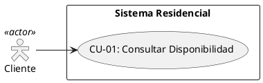
*Nota.* Muestra la relación y alcance de los actores con el caso de uso CU-01 (consultar disponibilidad).

##### Figura 2: Diagrama de Clases de Interfaz - CU-01 Consultar Disponibilidad

**Figura 2**

*Diagrama de Clases de Interfaz del caso de uso CU-01 (consultar disponibilidad).*

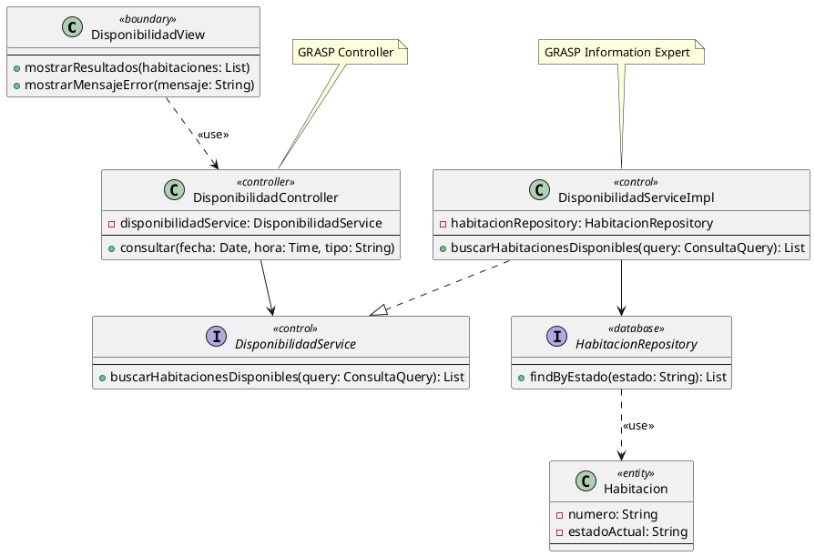
*Nota.* Muestra la estructura estática de clases e interfaces (CU-01) con estereotipos ICONIX.

##### Figura 3: Diagrama de Secuencia - CU-01 Consultar Disponibilidad

**Figura 3**

*Diagrama de Secuencia del caso de uso CU-01 (consultar disponibilidad).*

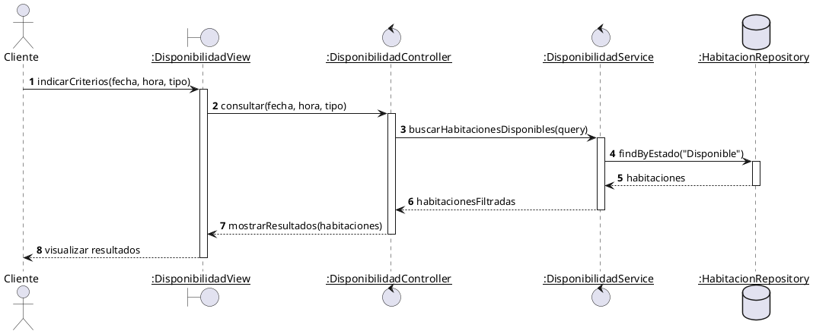
*Nota.* Flujo temporal y de ejecución de objetos en el caso de uso CU-01 con lifelines ICONIX.

##### Figura 4: Diagrama de Colaboración - CU-01 Consultar Disponibilidad

**Figura 4**

*Diagrama de Colaboración del caso de uso CU-01 (consultar disponibilidad).*

```plantuml
@startuml
left to right direction
actor Cliente
boundary "<u>:DisponibilidadView</u>" as View
control "<u>:DisponibilidadController</u>" as Ctrl
control "<u>:DisponibilidadService</u>" as Serv
database "<u>:HabitacionRepository</u>" as Repo

Cliente --> View : 1: indicarCriterios(fecha, hora, tipo)
View --> Ctrl : 1.1: consultar(fecha, hora, tipo)
Ctrl --> Serv : 1.1.1: buscarHabitacionesDisponibles(query)
Serv --> Repo : 1.1.1.1: findByEstado("Disponible")
@enduml
```
*Nota.* Colaboración de objetos (diagrama de robustez ICONIX) con numeración de llamadas anidadas.

##### Figura 5: Diagrama de Paquetes - CU-01 Consultar Disponibilidad

**Figura 5**

*Diagrama de Paquetes del caso de uso CU-01 (consultar disponibilidad).*

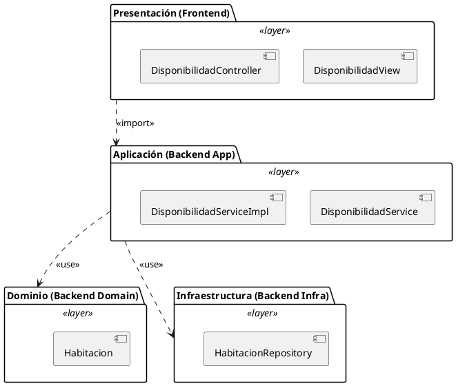
*Nota.* Organización en capas de desarrollo para el caso de uso CU-01.

---

### CU-02: Registrar Reserva

#### Actores
* **Primario:** Cliente (Huésped)
* **Alternativo:** Recepcionista (en representación del cliente)

#### Tipo
* Primario / Esencial

#### Propósito
Registrar formalmente el compromiso de reserva de una habitación específica para un huésped y asociarle un identificador único.

#### Resumen
El cliente (o el recepcionista) selecciona una habitación disponible en un horario definido y proporciona la información de identificación personal del huésped. El sistema registra la reserva en estado "PENDIENTE_PAGO" y asocia temporalmente el recurso de la habitación.

#### Precondición
* Se debe haber verificado la disponibilidad de la habitación en el período solicitado (CU-01).

#### Curso Básico de Acción

| Actor (Cliente / Recepcionista) | Respuestas del Sistema |
|---|---|
| **1.** Solicita reservar la habitación seleccionada introduciendo los datos personales del huésped (nombre, cédula de identidad, celular y fecha de nacimiento) y la información de la estadía. | **2.** El sistema verifica que la habitación elegida continúe libre para el período seleccionado y valida los datos de registro ingresados. |
| **3.** Confirma los datos de la reserva para su procesamiento. | **4.** El sistema registra la reserva en estado "PENDIENTE_PAGO", asocia temporalmente la habitación y genera un identificador único de reserva. |

#### Caminos Alternativos
* **Paso 2a (Habitación ocupada en el proceso):** Si la habitación fue reservada por otro usuario durante el proceso, el sistema notifica el conflicto de disponibilidad, ofrece recursos alternativos equivalentes y permite reiniciar la selección.
* **Paso 2b (Huésped ya registrado en la base de datos):** Si la cédula de identidad ya existe en el sistema, el sistema reconoce el registro previo, precarga los datos históricos correspondientes y asocia la nueva reserva a la cuenta del huésped.

#### Postcondición
* La reserva queda registrada en estado "PENDIENTE_PAGO", y la habitación queda bloqueada temporalmente para el período correspondiente a la espera de la confirmación del pago.

##### Diagramas UML (PlantUML)

##### Figura 6: Diagrama de Caso de Uso - CU-02 Registrar Reserva

**Figura 6**

*Diagrama de Caso de Uso del caso de uso CU-02 (registrar reserva).*

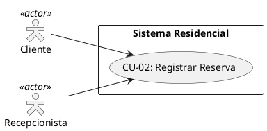
*Nota.* Muestra la relación y alcance de los actores con el caso de uso CU-02 (registrar reserva).

##### Figura 7: Diagrama de Clases de Interfaz - CU-02 Registrar Reserva

**Figura 7**

*Diagrama de Clases de Interfaz del caso de uso CU-02 (registrar reserva).*

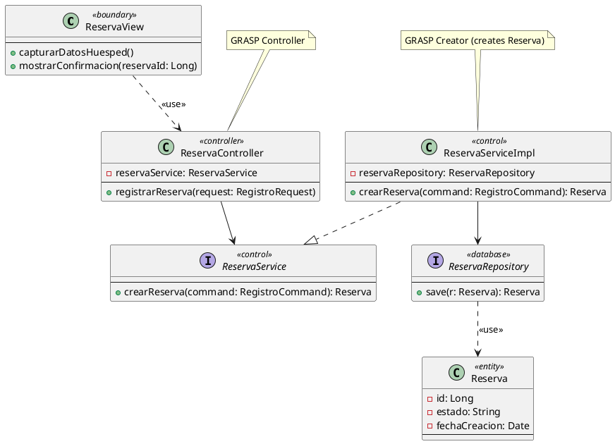
*Nota.* Muestra la estructura estática de clases e interfaces (CU-02) con estereotipos ICONIX.

##### Figura 8: Diagrama de Secuencia - CU-02 Registrar Reserva

**Figura 8**

*Diagrama de Secuencia del caso de uso CU-02 (registrar reserva).*

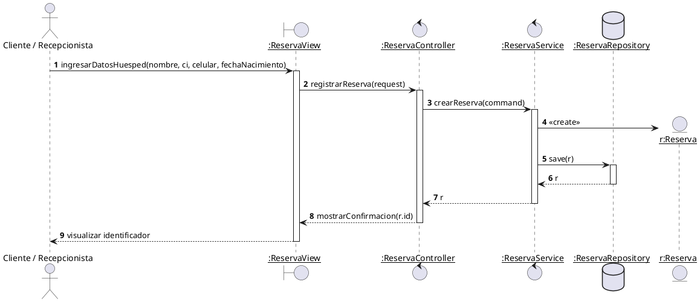
*Nota.* Flujo temporal y de ejecución de objetos en el caso de uso CU-02 con lifelines ICONIX.

##### Figura 9: Diagrama de Colaboración - CU-02 Registrar Reserva

**Figura 9**

*Diagrama de Colaboración del caso de uso CU-02 (registrar reserva).*

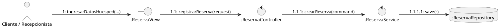
*Nota.* Colaboración de objetos (diagrama de robustez ICONIX) con numeración de llamadas anidadas.

##### Figura 10: Diagrama de Paquetes - CU-02 Registrar Reserva

**Figura 10**

*Diagrama de Paquetes del caso de uso CU-02 (registrar reserva).*

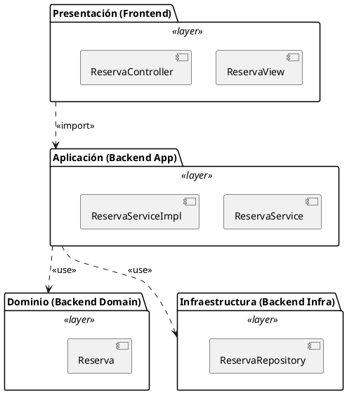
*Nota.* Organización en capas de desarrollo para el caso de uso CU-02.

---

### CU-03: Procesar Pago

#### Actores
* **Primario:** Cliente (Huésped)
* **Secundario:** Recepcionista, API Externa de la Entidad Bancaria (BNB)

#### Tipo
* Primario / Esencial

#### Propósito
Formalizar la reserva mediante la validación, confirmación y registro del cobro financiero correspondiente.

#### Resumen
Con base en una reserva pendiente, el sistema presenta los métodos de pago autorizados (QR bancario o efectivo). Si se selecciona QR, interactúa con la API bancaria externa para generar el código dinámico y confirmar la transacción. Si se selecciona efectivo, registra la intención de pago para validación en recepción.

#### Precondición
* Debe existir una reserva registrada en estado "PENDIENTE_PAGO" (CU-02).

#### Curso Básico de Acción

| Actor (Cliente / Recepcionista) | Respuestas del Sistema |
|---|---|
| **1.** El cliente solicita realizar el pago de su reserva pendiente seleccionando la opción de pago por QR bancario. | **2.** El sistema calcula el monto exacto, solicita la generación de un código QR dinámico a la API del BNB y presenta las instrucciones de pago. |
| **3.** El cliente realiza la transferencia bancaria escaneando el código QR. | **4.** El sistema valida la recepción del pago consultando el estado de la transacción con la API bancaria del BNB. |
| **5.** El cliente solicita la confirmación de la operación. | **6.** El sistema cambia el estado de la reserva a "PAGADA", genera un comprobante de pago con número correlativo único, calcula la hora límite de llegada (ventana de check-in de 30 minutos) y emite la confirmación. |

#### Caminos Alternativos
* **Paso 1a (Pago en Efectivo):** Si el cliente selecciona la opción de pago en efectivo, el sistema registra la transacción bajo este método, vincula la reserva al proceso de cobro físico en recepción y emite la confirmación pendiente de validación presencial, calculando la ventana de arribo de 30 minutos.
* **Paso 4a (Falla del servicio bancario externo):** Si el sistema detecta que la API de la entidad bancaria externa no responde, notifica la falla de conexión al cliente y ofrece opciones alternativas como el pago presencial en recepción.
* **Paso 4b (Código QR expirado):** Si transcurren más de 5 minutos sin verificar el pago, el sistema anula el código QR generado, notifica al cliente y permite generar un nuevo código de pago.

#### Postcondición
* La reserva cambia a estado "PAGADA" (o comprometida para pago presencial en recepción) y se emite un comprobante digital único con la hora del pago y la ventana de check-in calculada.

##### Diagramas UML (PlantUML)

##### Figura 11: Diagrama de Caso de Uso - CU-03 Procesar Pago

**Figura 11**

*Diagrama de Caso de Uso del caso de uso CU-03 (procesar pago).*

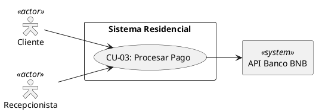
*Nota.* Muestra la relación y alcance de los actores con el caso de uso CU-03 (procesar pago).

##### Figura 12: Diagrama de Clases de Interfaz - CU-03 Procesar Pago

**Figura 12**

*Diagrama de Clases de Interfaz del caso de uso CU-03 (procesar pago).*

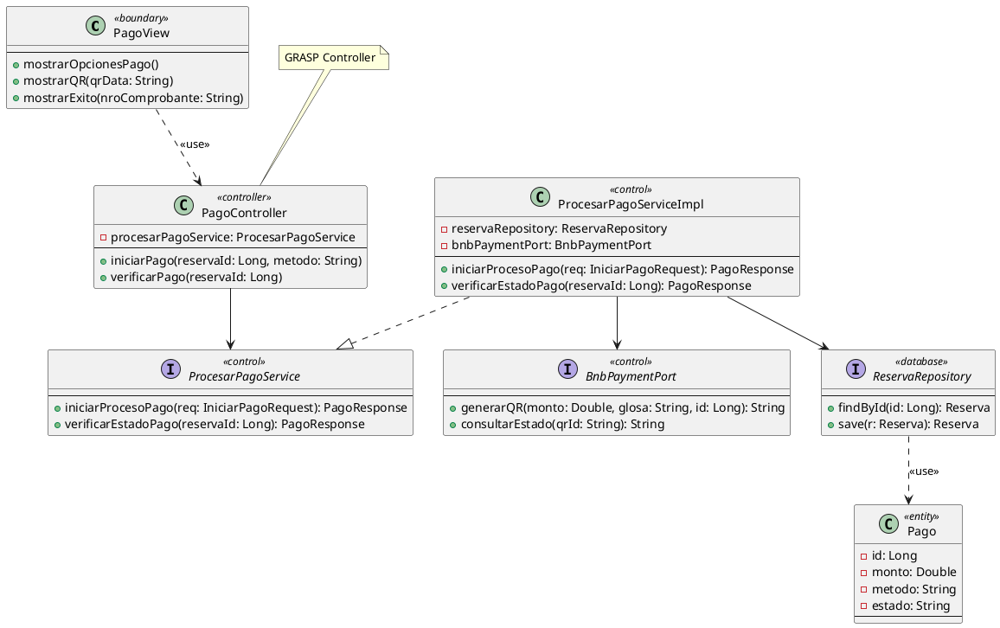
*Nota.* Muestra la estructura estática de clases e interfaces (CU-03) con estereotipos ICONIX.

##### Figura 13: Diagrama de Secuencia - CU-03 Procesar Pago

**Figura 13**

*Diagrama de Secuencia del caso de uso CU-03 (procesar pago).*

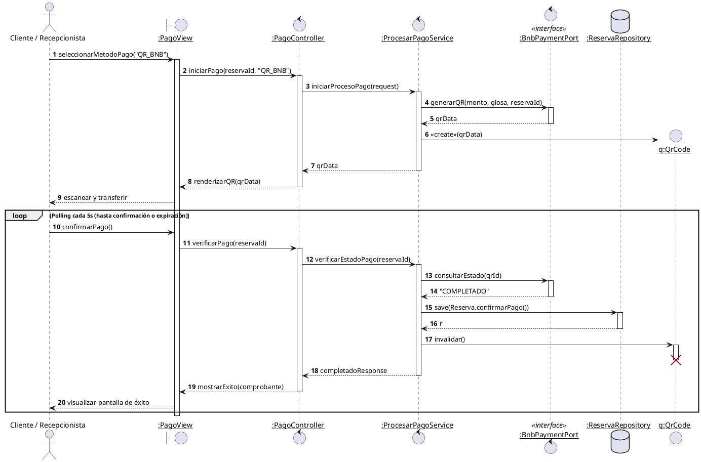
*Nota.* Flujo temporal y de ejecución de objetos en el caso de uso CU-03 con lifelines ICONIX.

##### Figura 14: Diagrama de Colaboración - CU-03 Procesar Pago

**Figura 14**

*Diagrama de Colaboración del caso de uso CU-03 (procesar pago).*

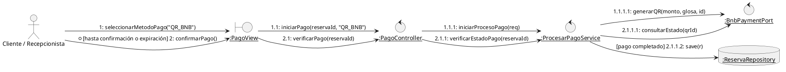
*Nota.* Colaboración de objetos (diagrama de robustez ICONIX) con numeración de llamadas anidadas.

##### Figura 15: Diagrama de Paquetes - CU-03 Procesar Pago

**Figura 15**

*Diagrama de Paquetes del caso de uso CU-03 (procesar pago).*

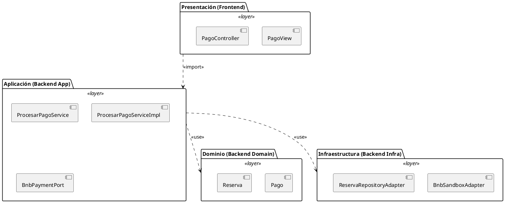
*Nota.* Organización en capas de desarrollo para el caso de uso CU-03.

---

### CU-04: Realizar Check-in

#### Actores
* **Primario:** Recepcionista
* **Secundario:** Personal de Limpieza

#### Tipo
* Primario / Esencial

#### Propósito
Registrar el ingreso físico del huésped, entregar los accesorios de la habitación y controlar el ciclo de vida del estado de la habitación (limpieza, mantenimiento y disponibilidad).

#### Resumen
El recepcionista verifica la reserva activa o procesa una llegada directa, realiza el cobro si corresponde y registra la asignación de los accesorios. Al finalizar el tiempo de estadía, se verifica la devolución de accesorios, se asigna la habitación al personal de limpieza y se libera tras el reporte final del personal.

#### Precondición
* La habitación seleccionada debe estar en un estado coherente con el paso del ciclo de vida (Disponible para ingreso, Ocupada para salida).

#### Curso Básico de Acción

| Actor (Recepcionista / Personal de Limpieza) | Respuestas del Sistema |
|---|---|
| **1.** El recepcionista busca la reserva activa del cliente (por nombre o identificador). | **2.** El sistema valida la reserva pagada dentro del tiempo límite de la ventana de ingreso y muestra los datos asociados. |
| **3.** El recepcionista registra la entrega física de la tarjeta de acceso y los controles de los dispositivos al cliente. | **4.** El sistema registra la asignación de los accesorios, cambia el estado de la reserva a "ACTIVA" y actualiza la habitación a estado "OCUPADA". |
| **5.** El recepcionista inicia el check-out tras la entrega de los accesorios por parte del cliente al finalizar el tiempo de estadía. | **6.** El sistema verifica la devolución conforme a los accesorios registrados y actualiza la habitación a estado "EN LIMPIEZA". |
| **7.** El personal de limpieza reporta la finalización de los trabajos de desinfección e higiene de la habitación. | **8.** El sistema actualiza el registro de estado de la habitación a "DISPONIBLE", quedando libre para una nueva reserva. |

#### Caminos Alternativos
* **Paso 1a (Llegada directa sin reserva):** El recepcionista busca habitaciones disponibles de forma manual. El sistema muestra las opciones libres y permite registrar los datos del cliente. El recepcionista procesa el pago correspondiente (QR o efectivo) y continúa con la entrega de accesorios.
* **Paso 2a (Pago en efectivo pendiente):** Si la reserva tiene pago pendiente en recepción, el recepcionista recibe y procesa el pago físico. El sistema valida el pago, actualiza la reserva a estado "PAGADA" y continúa con el flujo de check-in.
* **Paso 5a (Exceso de tiempo de estadía):** Si el cliente excede el tiempo límite de ocupación establecido, el sistema calcula automáticamente el recargo adicional por concepto de tiempo extra. El recepcionista cobra la diferencia correspondiente y registra el pago del tiempo extra antes de procesar la salida.

#### Postcondición
* El ingreso y salida física quedan documentados, el estado de la habitación pasa por el flujo Ocupada $\rightarrow$ En Limpieza $\rightarrow$ Disponible, y el retorno de los accesorios queda validado.

##### Diagramas UML (PlantUML)

##### Figura 16: Diagrama de Caso de Uso - CU-04 Realizar Check-in y Flujo Físico

**Figura 16**

*Diagrama de Caso de Uso del caso de uso CU-04 (realizar check-in y flujo físico).*

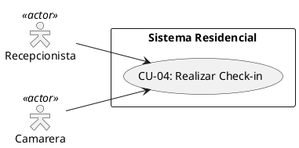
*Nota.* Muestra la relación y alcance de los actores con el caso de uso CU-04 (realizar check-in y flujo físico).

##### Figura 17: Diagrama de Clases de Interfaz - CU-04 Realizar Check-in y Flujo Físico

**Figura 17**

*Diagrama de Clases de Interfaz del caso de uso CU-04 (realizar check-in y flujo físico).*

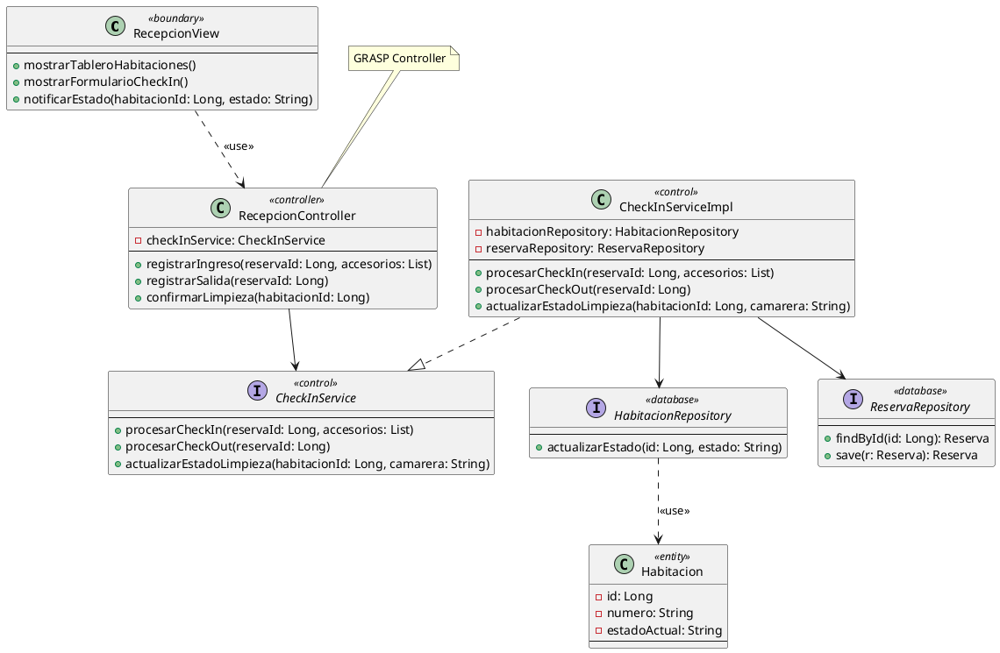
*Nota.* Muestra la estructura estática de clases e interfaces (CU-04) con estereotipos ICONIX.

##### Figura 18: Diagrama de Secuencia - CU-04 Realizar Check-in y Flujo Físico

**Figura 18**

*Diagrama de Secuencia del caso de uso CU-04 (realizar check-in y flujo físico).*

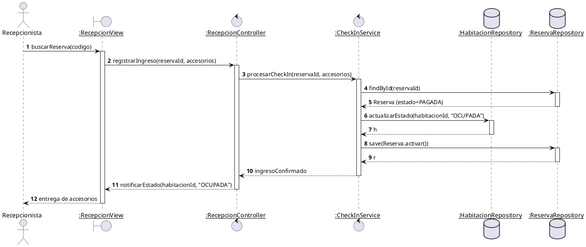
*Nota.* Flujo temporal y de ejecución de objetos en el caso de uso CU-04 con lifelines ICONIX.

##### Figura 19: Diagrama de Colaboración - CU-04 Realizar Check-in y Flujo Físico

**Figura 19**

*Diagrama de Colaboración del caso de uso CU-04 (realizar check-in y flujo físico).*

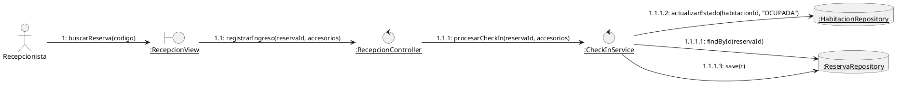
*Nota.* Colaboración de objetos (diagrama de robustez ICONIX) con numeración de llamadas anidadas.

##### Figura 20: Diagrama de Paquetes - CU-04 Realizar Check-in y Flujo Físico

**Figura 20**

*Diagrama de Paquetes del caso de uso CU-04 (realizar check-in y flujo físico).*

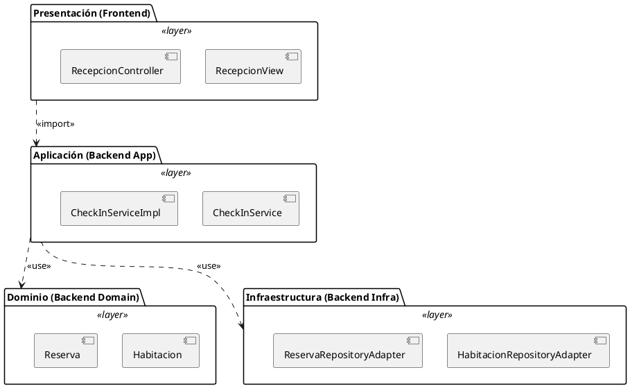
*Nota.* Organización en capas de desarrollo para el caso de uso CU-04.

---

### CU-05: Acceso por QR en Puerta

#### Actores
* **Primario:** Cliente (Huésped)
* **Secundario:** Sistema de Control de Acceso

#### Tipo
* Primario / Esencial (Caja Negra)

#### Propósito
Permitir la apertura física autónoma de la habitación asignada al cliente mediante la validación electrónica de su comprobante de pago.

#### Resumen
El cliente presenta su código QR de acceso al sensor de la puerta asignada. El sistema valida el código, verifica que corresponda a esa habitación y esté en período de validez, desbloquea físicamente la puerta de la habitación y registra el ingreso del huésped.

#### Precondición
* El cliente debe poseer un código QR de acceso generado en una reserva pagada o activa (CU-03 / CU-04).

#### Curso Básico de Acción

| Actor (Cliente) | Respuestas del Sistema |
|---|---|
| **1.** El cliente presenta el código QR de acceso al lector electrónico de la puerta de la habitación. | **2.** El sistema captura la información codificada y la contrasta con el registro de reservas activas y pagadas. |
| **3.** El cliente solicita el ingreso físico a la habitación. | **4.** El sistema valida que la reserva esté pagada o activa, corresponda a la habitación física solicitada y se encuentre en la ventana de tiempo de ingreso autorizada. |
| **5.** El cliente empuja la puerta. | **6.** El sistema activa la apertura de la cerradura electrónica, registra la fecha y hora exacta del primer ingreso y actualiza el estado de la habitación a "OCUPADA". |

#### Caminos Alternativos
* **Paso 4a (Código QR inválido o incorrecto):** Si el código QR es inválido o no corresponde a la habitación en la que se está intentando el acceso, el sistema rechaza la solicitud de apertura y emite una alerta de error.
* **Paso 4b (Expiración de la ventana de check-in):** Si la ventana de check-in de 30 minutos ha expirado sin registrar pago o llegada válida, el sistema deniega el acceso, emite un aviso de cancelación por incomparecencia (No-Show) y mantiene la puerta cerrada.

#### Postcondición
* Se registra el ingreso del huésped en el sistema, se desbloquea físicamente la puerta de la habitación y esta pasa a estado "OCUPADA".

##### Diagramas UML (PlantUML)

##### Figura 21: Diagrama de Caso de Uso - CU-05 Acceso por QR en Puerta

**Figura 21**

*Diagrama de Caso de Uso del caso de uso CU-05 (acceso por qr en puerta).*

```plantuml
@startuml
left to right direction
skinparam actorStyle hollow
actor "Cliente" as Cliente <<actor>>
rectangle "Sistema de Control de Acceso" as Sistema <<system>>
rectangle "Sistema Residencial" {
  usecase "CU-05: Acceso por QR en Puerta" as CU05
}
Cliente --> CU05
CU05 --> Sistema
@enduml
```
*Nota.* Muestra la relación y alcance de los actores con el caso de uso CU-05 (acceso por qr en puerta).

##### Figura 22: Diagrama de Clases de Interfaz - CU-05 Acceso por QR en Puerta

**Figura 22**

*Diagrama de Clases de Interfaz del caso de uso CU-05 (acceso por qr en puerta).*

```plantuml
@startuml
class PuertaView <<boundary>> {
  --
  +capturarQR()
  +mostrarAccesoAutorizado(mensaje: String)
  +mostrarAccesoDenegado(mensaje: String)
}
class PuertaController <<controller>> {
  -puertaService: PuertaService
  --
  +validarAccesoQR(codigo: String, habitacionId: Long)
}
interface PuertaService <<control>> {
  --
  +verificarYRegistrarAcceso(codigo: String, habitacionId: Long): AccesoResponse
}
class PuertaServiceImpl <<control>> {
  -reservaRepository: ReservaRepository
  -habitacionRepository: HabitacionRepository
  --
  +verificarYRegistrarAcceso(codigo: String, habitacionId: Long): AccesoResponse
}
class Reserva <<entity>> {
  -codigoQR: String
  -estado: String
  --
}
interface ReservaRepository <<database>> {
  --
  +findByCodigo(codigo: String): Reserva
  +save(r: Reserva): Reserva
}
interface HabitacionRepository <<database>> {
  --
  +actualizarEstado(id: Long, estado: String)
}
PuertaView ..> PuertaController : <<use>>
PuertaController --> PuertaService
PuertaServiceImpl ..|> PuertaService
PuertaServiceImpl --> ReservaRepository
PuertaServiceImpl --> HabitacionRepository
ReservaRepository ..> Reserva : <<use>>
note top of PuertaController : GRASP Controller
@enduml
```
*Nota.* Muestra la estructura estática de clases e interfaces (CU-05) con estereotipos ICONIX.

##### Figura 23: Diagrama de Secuencia - CU-05 Acceso por QR en Puerta

**Figura 23**

*Diagrama de Secuencia del caso de uso CU-05 (acceso por qr en puerta).*

```plantuml
@startuml
autonumber
actor Cliente
boundary "<u>:PuertaView</u>" as View
control "<u>:PuertaController</u>" as Ctrl
control "<u>:PuertaService</u>" as Serv
database "<u>:ReservaRepository</u>" as ResRepo
database "<u>:HabitacionRepository</u>" as HabRepo

Cliente -> View : escanearQR(codigo)
activate View
View -> Ctrl : validarAccesoQR(codigo, habitacionId)
activate Ctrl
Ctrl -> Serv : verificarYRegistrarAcceso(codigo, habitacionId)
activate Serv
Serv -> ResRepo : findByCodigo(codigo)
activate ResRepo
ResRepo --> Serv : Reserva
deactivate ResRepo
Serv -> Serv : validarReservaHabitacionYEstado()
alt Acceso Válido
  Serv -> HabRepo : actualizarEstado(habitacionId, "OCUPADA")
  activate HabRepo
  HabRepo --> Serv : h
  deactivate HabRepo
  Serv -> ResRepo : save(Reserva.registrarIngreso())
  activate ResRepo
  ResRepo --> Serv : r
  deactivate ResRepo
  Serv --> Ctrl : autorizadoResponse
  Ctrl --> View : mostrarAccesoAutorizado(mensaje)
  View --> Cliente : puerta desbloqueada
else Acceso Inválido
  Serv --> Ctrl : denegadoResponse
  deactivate Serv
  Ctrl --> View : mostrarAccesoDenegado(mensaje)
  deactivate Ctrl
  View --> Cliente : puerta bloqueada
end
deactivate View
@enduml
```
*Nota.* Flujo temporal y de ejecución de objetos en el caso de uso CU-05 con lifelines ICONIX.

##### Figura 24: Diagrama de Colaboración - CU-05 Acceso por QR en Puerta

**Figura 24**

*Diagrama de Colaboración del caso de uso CU-05 (acceso por qr en puerta).*

```plantuml
@startuml
left to right direction
actor Cliente
boundary "<u>:PuertaView</u>" as View
control "<u>:PuertaController</u>" as Ctrl
control "<u>:PuertaService</u>" as Serv
database "<u>:ReservaRepository</u>" as ResRepo
database "<u>:HabitacionRepository</u>" as HabRepo

Cliente --> View : 1: escanearQR(codigo)
View --> Ctrl : 1.1: validarAccesoQR(codigo, habitacionId)
Ctrl --> Serv : 1.1.1: verificarYRegistrarAcceso(codigo, habitacionId)
Serv --> ResRepo : 1.1.1.1: findByCodigo(codigo)
Serv --> HabRepo : [acceso válido] 1.1.1.2: actualizarEstado(habitacionId, "OCUPADA")
Serv --> ResRepo : [acceso válido] 1.1.1.3: save(r)
@enduml
```
*Nota.* Colaboración de objetos (diagrama de robustez ICONIX) con numeración de llamadas anidadas.

##### Figura 25: Diagrama de Paquetes - CU-05 Acceso por QR en Puerta

**Figura 25**

*Diagrama de Paquetes del caso de uso CU-05 (acceso por qr en puerta).*

```plantuml
@startuml
package "Presentación (Frontend)" <<layer>> {
  [PuertaView]
  [PuertaController]
}
package "Aplicación (Backend App)" <<layer>> {
  [PuertaService]
  [PuertaServiceImpl]
}
package "Dominio (Backend Domain)" <<layer>> {
  [Reserva]
  [Habitacion]
}
package "Infraestructura (Backend Infra)" <<layer>> {
  [ReservaRepositoryAdapter]
  [HabitacionRepositoryAdapter]
}
"Presentación (Frontend)" ..> "Aplicación (Backend App)" : <<import>>
"Aplicación (Backend App)" ..> "Dominio (Backend Domain)" : <<use>>
"Aplicación (Backend App)" ..> "Infraestructura (Backend Infra)" : <<use>>
@enduml
```
*Nota.* Organización en capas de desarrollo para el caso de uso CU-05.

---

### CU-06: Pago de Consumo Extra

#### Actores
* **Primario:** Cliente (Huésped)
* **Secundario:** API Externa de la Entidad Bancaria (BNB)

#### Tipo
* Secundario / Esencial

#### Propósito
Gestionar y cobrar los productos y servicios adicionales consumidos por el huésped de forma directa y automatizada desde la habitación.

#### Resumen
Durante la estadía, el huésped selecciona productos adicionales disponibles en su habitación. El sistema registra el pedido en estado pendiente, genera un código QR por el total de los artículos seleccionados y, tras la confirmación de la transferencia bancaria externa, marca los consumos como pagados.

#### Precondición
* Debe haber un check-in registrado y la estadía del huésped debe estar en estado activo (CU-04 / CU-05).

#### Curso Básico de Acción

| Actor (Cliente) | Respuestas del Sistema |
|---|---|
| **1.** El cliente inicia la solicitud de consumo extra seleccionando productos del catálogo provisto en la habitación. | **2.** El sistema registra de manera temporal la lista de productos y calcula el monto total del pedido. |
| **3.** El cliente confirma la solicitud de consumos. | **4.** El sistema solicita a la API del BNB la generación de un código QR por el monto total calculado. |
| **5.** El cliente realiza el pago bancario correspondiente escaneando el código QR. | **6.** El sistema valida el pago con la API bancaria del BNB, cambia el estado del consumo a "PAGADO", registra la transacción y genera el comprobante digital de consumo. |

#### Caminos Alternativos
* **Paso 5a (Cancelación del pedido):** Si el cliente decide cancelar la solicitud de consumos antes de realizar el pago, el cliente anula la operación. El sistema limpia la lista temporal de productos y retorna la sesión al estado de espera.
* **Paso 6a (Falla en el Pago / Expiración de QR):** Si la transacción del QR es rechazada o el tiempo de validez del código expira sin concretar el pago, el sistema notifica la falla de la transacción, anula el código QR y permite volver a generar el pedido.

#### Postcondición
* Los consumos adicionales quedan registrados como pagados en la base de datos, asociados a la reserva de la habitación.

##### Diagramas UML (PlantUML)

##### Figura 26: Diagrama de Caso de Uso - CU-06 Pago de Consumo Extra

**Figura 26**

*Diagrama de Caso de Uso del caso de uso CU-06 (pago de consumo extra).*

```plantuml
@startuml
left to right direction
skinparam actorStyle hollow
actor "Cliente" as Cliente <<actor>>
rectangle "API Banco BNB" as BNB <<system>>
rectangle "Sistema Residencial" {
  usecase "CU-06: Pago de Consumo Extra" as CU06
}
Cliente --> CU06
CU06 --> BNB
@enduml
```
*Nota.* Muestra la relación y alcance de los actores con el caso de uso CU-06 (pago de consumo extra).

##### Figura 27: Diagrama de Clases de Interfaz - CU-06 Pago de Consumo Extra

**Figura 27**

*Diagrama de Clases de Interfaz del caso de uso CU-06 (pago de consumo extra).*

```plantuml
@startuml
class TabletView <<boundary>> {
  --
  +mostrarMenuConsumos()
  +mostrarQRConsumo(qrData: String)
  +confirmarPagoConsumo()
}
class ConsumoController <<controller>> {
  -consumoService: ConsumoExtraService
  --
  +registrarPedido(reservaId: Long, items: List)
  +verificarPagoConsumo(consumoId: Long)
}
interface ConsumoExtraService <<control>> {
  --
  +crearConsumoPendiente(reservaId: Long, items: List): ConsumoResponse
  +confirmarPagoConsumo(consumoId: Long): ConsumoResponse
}
class ConsumoExtraServiceImpl <<control>> {
  -consumoRepository: ConsumoRepository
  -bnbPaymentPort: BnbPaymentPort
  --
  +crearConsumoPendiente(reservaId: Long, items: List): ConsumoResponse
  +confirmarPagoConsumo(consumoId: Long): ConsumoResponse
}
interface BnbPaymentPort <<control>> {
  --
  +generarQR(total: Double, glosa: String, id: Long): String
  +consultarEstado(qrId: String): String
}
class ConsumoExtra <<entity>> {
  -id: Long
  -itemsJson: String
  -total: Double
  -estado: String
  --
}
interface ConsumoRepository <<database>> {
  --
  +save(c: ConsumoExtra): ConsumoExtra
  +findById(id: Long): ConsumoExtra
}
TabletView ..> ConsumoController : <<use>>
ConsumoController --> ConsumoExtraService
ConsumoExtraServiceImpl ..|> ConsumoExtraService
ConsumoExtraServiceImpl --> ConsumoRepository
ConsumoExtraServiceImpl --> BnbPaymentPort
ConsumoRepository ..> ConsumoExtra : <<use>>
note top of ConsumoController : GRASP Controller
@enduml
```
*Nota.* Muestra la estructura estática de clases e interfaces (CU-06) con estereotipos ICONIX.

##### Figura 28: Diagrama de Secuencia - CU-06 Pago de Consumo Extra

**Figura 28**

*Diagrama de Secuencia del caso de uso CU-06 (pago de consumo extra).*

```plantuml
@startuml
autonumber
actor Cliente
boundary "<u>:TabletView</u>" as View
control "<u>:ConsumoController</u>" as Ctrl
control "<u>:ConsumoExtraService</u>" as Serv
control "<u>:BnbPaymentPort</u>" as BNB <<interface>>
database "<u>:ConsumoRepository</u>" as Repo

Cliente -> View : confirmarPedido(items)
activate View
View -> Ctrl : registrarPedido(reservaId, items)
activate Ctrl
Ctrl -> Serv : crearConsumoPendiente(reservaId, items)
activate Serv
Serv -> BNB : generarQR(total, "Consumos Extra", reservaId)
activate BNB
BNB --> Serv : qrData
deactivate BNB
create entity "<u>q:QrCode</u>" as QR
Serv -> QR : <<create>>(qrData)
Serv -> Repo : save(ConsumoExtra)
activate Repo
Repo --> Serv : c
deactivate Repo
Serv --> Ctrl : c
deactivate Serv
Ctrl --> View : mostrarQRConsumo(qrData)
deactivate Ctrl
View --> Cliente : pagar consumos

Cliente -> View : confirmarPagoConsumo()
View -> Ctrl : verificarPagoConsumo(consumoId)
activate Ctrl
Ctrl -> Serv : confirmarPagoConsumo(consumoId)
activate Serv
Serv -> BNB : consultarEstado(qrId)
activate BNB
BNB --> Serv : "COMPLETADO"
deactivate BNB
Serv -> Repo : save(ConsumoExtra.pagar())
activate Repo
Repo --> Serv : c
deactivate Repo
Serv -> QR : invalidar()
activate QR
deactivate QR
destroy QR
Serv --> Ctrl : pagoConfirmado
deactivate Serv
Ctrl --> View : mostrarExito()
deactivate Ctrl
View --> Cliente : visualizar pantalla de éxito
deactivate View
@enduml
```
*Nota.* Flujo temporal y de ejecución de objetos en el caso de uso CU-06 con lifelines ICONIX.

##### Figura 29: Diagrama de Colaboración - CU-06 Pago de Consumo Extra

**Figura 29**

*Diagrama de Colaboración del caso de uso CU-06 (pago de consumo extra).*

```plantuml
@startuml
left to right direction
actor Cliente
boundary "<u>:TabletView</u>" as View
control "<u>:ConsumoController</u>" as Ctrl
control "<u>:ConsumoExtraService</u>" as Serv
control "<u>:BnbPaymentPort</u>" as BNB
database "<u>:ConsumoRepository</u>" as Repo

Cliente --> View : 1: confirmarPedido(items)
View --> Ctrl : 1.1: registrarPedido(reservaId, items)
Ctrl --> Serv : 1.1.1: crearConsumoPendiente(reservaId, items)
Serv --> BNB : 1.1.1.1: generarQR(total, glosa, id)
Serv --> Repo : 1.1.1.2: save(c)

Cliente --> View : 2: confirmarPagoConsumo()
View --> Ctrl : 2.1: verificarPagoConsumo(consumoId)
Ctrl --> Serv : 2.1.1: confirmarPagoConsumo(consumoId)
Serv --> BNB : 2.1.1.1: consultarEstado(qrId)
Serv --> Repo : [pago completado] 2.1.1.2: save(c.pagar())
@enduml
```
*Nota.* Colaboración de objetos (diagrama de robustez ICONIX) con numeración de llamadas anidadas.

##### Figura 30: Diagrama de Paquetes - CU-06 Pago de Consumo Extra

**Figura 30**

*Diagrama de Paquetes del caso de uso CU-06 (pago de consumo extra).*

```plantuml
@startuml
package "Presentación (Frontend)" <<layer>> {
  [TabletView]
  [ConsumoController]
}
package "Aplicación (Backend App)" <<layer>> {
  [ConsumoExtraService]
  [ConsumoExtraServiceImpl]
  [BnbPaymentPort]
}
package "Dominio (Backend Domain)" <<layer>> {
  [ConsumoExtra]
  [Reserva]
}
package "Infraestructura (Backend Infra)" <<layer>> {
  [ConsumoRepositoryAdapter]
  [BnbSandboxAdapter]
}
"Presentación (Frontend)" ..> "Aplicación (Backend App)" : <<import>>
"Aplicación (Backend App)" ..> "Dominio (Backend Domain)" : <<use>>
"Aplicación (Backend App)" ..> "Infraestructura (Backend Infra)" : <<use>>
@enduml
```
*Nota.* Organización en capas de desarrollo para el caso de uso CU-06.

---

#### Figura 1: Diagrama de Caso de Uso 1

*(Insertar Diagrama de Caso de Uso aquí)*

#### Figura 5: Pantalla de Caso de Uso

*(Insertar Pantalla de Caso de Uso aquí)*

---

## Modelo de Dominio del Sistema (Figura 31)

##### Figura 31: Modelo de Dominio del Sistema

**Figura 31**

*Modelo de dominio del sistema.*

```plantuml
@startuml
hide methods
hide circle

class Huesped {
  nombre
  ci
  celular
  fechaNacimiento
}

class Reserva {
  montoTotal
  fechaCreacion
  fechaIngreso
  cantidadBloques
  estado
  horaIngreso
  horaSalidaEstimada
}

class Habitacion {
  numero
  estadoActual
}

class TipoHabitacion {
  nombreTipo
  precioBase
  duracionHoras
  descripcion
}

class Pago {
  monto
  metodo
  estado
  fechaCreacion
}

class Comprobante {
  nroComprobante
  fechaEmision
}

class Recepcionista {
  nombre
  username
  activo
}

class Camarera {
  nombre
  celular
  activo
}

class InventarioItem {
  nombre
  tipo
  stockActual
  precioVenta
  emoji
}

class HabitacionInventario {
  cantidadEsperada
  cantidadActual
  estadoVerificacion
}

class IncidenciaMantenimiento {
  descripcion
  seguimiento
  fechaReporte
  estado
  costoReparacion
}

class ConsumoExtra {
  itemsJson
  total
  estado
  fechaCreacion
}

class Egreso {
  descripcion
  monto
  categoria
  fecha
}

Huesped "1" -- "*" Reserva : realiza >
Huesped "0..1" -- "*" Reserva : acompaña en >
Habitacion "1" -- "*" Reserva : asignada a >
Reserva "1" -- "*" Pago : registra >
TipoHabitacion "1" -- "*" Habitacion : categoriza >
Pago "1" -- "1" Comprobante : respalda >
Habitacion "1" -- "*" HabitacionInventario : posee >
InventarioItem "1" -- "*" HabitacionInventario : incluido en >
Habitacion "1" -- "*" IncidenciaMantenimiento : sufre >
InventarioItem "0..1" -- "*" IncidenciaMantenimiento : afectado por >
Reserva "1" -- "*" ConsumoExtra : genera >
Recepcionista "1" -- "*" Reserva : gestiona >
Camarera "1" -- "*" Habitacion : limpia >
Recepcionista "1" -- "*" Egreso : registra >
@enduml
```
*Nota.* Modelo de dominio relacional del sistema residencial que correlaciona directamente con la base de datos e implementación en Spring Boot.

---

## Caso de Uso del Sistema (Figura 32)

##### Figura 32: Caso de Uso del Sistema

**Figura 32**

*Mapa general de casos de uso del sistema.*

```plantuml
@startuml
left to right direction
skinparam actorStyle hollow

actor "Cliente" as Cliente <<actor>>
actor "Recepcionista" as Recepcionista <<actor>>
actor "Camarera" as Camarera <<actor>>
rectangle "API Banco BNB" as BNB <<system>>

rectangle "Sistema Residencial" {
  usecase "CU-01: Consultar Disponibilidad" as CU01
  usecase "CU-02: Registrar Reserva" as CU02
  usecase "CU-03: Procesar Pago" as CU03
  usecase "CU-04: Realizar Check-in y Flujo Físico" as CU04
  usecase "CU-05: Acceso por QR en Puerta" as CU05
  usecase "CU-06: Pago de Consumo Extra" as CU06
}

Cliente --> CU01
Cliente --> CU02
Cliente --> CU03
Cliente --> CU05
Cliente --> CU06

Recepcionista --> CU02
Recepcionista --> CU03
Recepcionista --> CU04

Camarera --> CU04

CU03 --> BNB
CU06 --> BNB
@enduml
```
*Nota.* Mapa de actores y casos de uso del sistema integrado.

---

## Diagrama de Actividad del Sistema (Figura 33)

##### Figura 33: Diagrama de Actividad del Sistema

**Figura 33**

*Diagrama de actividades del flujo de negocio global.*

```plantuml
@startuml
|Cliente|
start
:Iniciar Consulta de Habitación;
|Sistema|
repeat
  :Verificar disponibilidad;
  if (¿Habitaciones disponibles?) then (sí)
    break
  else (no)
    |Cliente|
    :Sugerir/Modificar criterios de búsqueda;
  endif
|Sistema|
repeat while (intentar nueva búsqueda)

|Cliente|
:Registrar datos personales del huésped;
|Sistema|
:Crear Reserva (estado: PENDIENTE_PAGO);
|Cliente|
if (Elegir método de pago) then (Código QR BNB)
  |Sistema|
  :Generar QR dinámico (API BNB);
  |Cliente|
  :Escanear QR y realizar transferencia;
  |Sistema|
  :Esperar confirmación de pago;
  if (¿Pago exitoso a tiempo?) then (sí)
    :Actualizar Reserva a PAGADA;
  else (no)
    :Anular reserva y liberar habitación;
    stop
  endif
else (Efectivo en recepción)
  |Sistema|
  :Registrar compromiso de pago presencial;
endif

:Establecer ventana de check-in de 30 minutos;
|Cliente|
:Presentarse físicamente en recepción;
|Recepcionista|
:Validar reserva y procesar check-in;
if (¿Pago en efectivo pendiente?) then (sí)
  :Cobrar monto en efectivo;
  |Sistema|
  :Actualizar Reserva a PAGADA;
else (no)
endif
|Recepcionista|
:Entregar tarjeta de acceso y controles;
|Sistema|
:Actualizar estado de Habitación a OCUPADA;

|Cliente|
:Ocupar habitación;
:Consumir extras y pagar vía QR;
:Entregar accesorios y cerrar puerta;

|Recepcionista|
:Validar accesorios y realizar check-out;
|Sistema|
:Actualizar estado de Habitación a EN LIMPIEZA;

|Camarera|
:Ingresar a habitación con tarjeta de servicio;
:Desinfectar e higienizar habitación;
:Notificar finalización por walkie-talkie;

|Recepcionista|
:Registrar informe de limpieza;
|Sistema|
:Actualizar estado de Habitación a DISPONIBLE;
stop
@enduml
```
*Nota.* Flujo de trabajo secuencial desde la consulta inicial hasta el check-out e higiene de habitaciones.

---

## Diagrama de Paquetes del Sistema (Figura 34)

##### Figura 34: Diagrama de Paquetes del Sistema

**Figura 34**

*Arquitectura de paquetes del sistema completo.*

```plantuml
@startuml
package "Presentación (Frontend)" as Frontend <<layer>> {
  [Vistas: index.html / recepcion.html / puerta.html] as UI
  [Controladores JS: DisponibilidadController / RecepcionController] as JS_Ctrl
}

package "Aplicación (Backend App)" as App <<layer>> {
  [Casos de Uso: CheckInService / ProcesarPagoService / ReservaService] as Services
  [Data Transfer Objects (DTOs)] as DTOs
  [Puertos: Repositories / Payment Gateway API Interfaces] as Ports
}

package "Dominio (Backend Domain)" as Domain <<layer>> {
  [Entidades: Reserva / Habitacion / Huesped / Pago] as Entities
}

package "Infraestructura (Backend Infra)" as Infra <<layer>> {
  [Controladores REST (APIs)] as REST
  [Adaptadores de Persistencia: Spring Data JPA] as Repos
  [Clientes Externos: BNB Payment Gateway Connector] as ExtAPIs
}

database "PostgreSQL Database" as DB {
  [Tablas: habitaciones / reservas / pagos / comprobantes] as Tables
}

Frontend ..> App : <<import>>
App ..> Domain : <<use>>
Infra ..> App : <<use>>
Infra ..> Domain : <<use>>
Infra ..> DB : <<use>>
@enduml
```
*Nota.* Representación de las capas lógicas y el flujo de dependencias de la arquitectura limpia.

---

## Diagrama de Actividad: Caso de uso principal – Realizar Reserva (Figura 35)

##### Figura 35: Diagrama de Actividad: Caso de uso principal – Realizar Reserva

**Figura 35**

*Diagrama de actividades para realizar reserva.*

```plantuml
@startuml
|Cliente|
start
:Ingresar al portal de reservas;
:Indicar fecha, hora y tipo de habitación;
|Sistema|
repeat
  :Buscar habitaciones disponibles;
  if (¿Hay habitaciones libres?) then (sí)
    break
  else (no)
    |Sistema|
    :Sugerir otra fecha o categoría;
    |Cliente|
    :Modificar criterios;
  endif
|Sistema|
repeat while (buscar de nuevo)

|Cliente|
:Seleccionar habitación y rellenar datos personales;
|Sistema|
:Validar datos del huésped;
if (¿Datos válidos?) then (sí)
  :Crear reserva en PENDIENTE_PAGO;
else (no)
  |Sistema|
  :Mostrar mensaje de error;
  |Cliente|
  :Corregir datos;
  stop
endif

|Cliente|
if (Elegir método de pago) then (QR BNB)
  |Sistema|
  :Llamar API de BNB y generar QR;
  |Cliente|
  :Realizar transferencia desde banca móvil;
  |Sistema|
  repeat
    :Verificar estado del pago (Polling);
    if (¿Pago recibido a tiempo?) then (sí)
      :Marcar reserva como PAGADA;
      :Emitir comprobante de pago;
      break
    else (no y expiró)
      :Anular reserva y liberar habitación;
      stop
    endif
  repeat while (esperar pago)
else (Efectivo)
  |Sistema|
  :Registrar reserva con compromiso de pago en recepción;
endif

|Sistema|
:Mostrar pantalla de confirmación exitosa;
:Advertir ventana de check-in de 30 minutos;
stop
@enduml
```
*Nota.* Detalle del flujo de control y decisiones en el proceso de reserva, registro y pago.

---

## Actividad de Objeto: Ciclo de vida de una habitación (Figura 36)

##### Figura 36: Actividad de Objeto: Ciclo de vida de una habitación

**Figura 36**

*Diagrama de estados para el ciclo de vida de una habitación.*

```plantuml
@startuml
[*] --> Disponible : Inicialización

Disponible --> Ocupada : Check-in de Huésped (CU-04 / CU-05)
Ocupada --> EnLimpieza : Check-out y Devolución de Accesorios (CU-04)
EnLimpieza --> Disponible : Notificación de Limpieza Concluida (CU-04)

Disponible --> Mantenimiento : Reporte de Daños o Desviación de Calidad (CU-04)
Mantenimiento --> Disponible : Resolución y Cierre de Incidencia (CU-04)
@enduml
```
*Nota.* Transiciones de estado (Disponible, Ocupada, En Limpieza, Mantenimiento) del recurso principal.

---

## Anexos

* **Anexo A:** Plantilla de base de datos completa (`04_Implementacion/sistema-integrado/backend/sql/init.sql`).
* **Anexo B:** Configuración del entorno de despliegue mediante contenedores Docker (`docker-compose.yml`).
* **Anexo C:** Suite de pruebas automatizadas de lógica de negocio en backend (`sistema-integrado/backend/src/test/java`).
