# **SISTEMA DE RESERVAS - REFACTORIZACIÓN V4**

**DOCENTE:** ING. NANCY YUDY VELÁSQUEZ SUAREZ  
**INTEGRANTES:**
* SANTIAGO BORDA 2021210057  
* FABRICIO PADILLA 2020128985

---

## **1. REQUISITOS DEL PROYECTO / DESCRIPCIÓN DEL NEGOCIO ACTUAL**

### **1.1 Descripción del Negocio Actual (Modelo Manual y Evolución)**
En el sector de servicios de alojamiento temporal, la gestión operativa tradicionalmente se basa en un modelo con digitalización fragmentada o nula. El proceso manual original presentaba flujos de trabajo aislados con altas tasas de error operativo, desfase temporal en el estado de las habitaciones y consolidación manual de caja al cierre de cada turno. 

La implementación actual ha evolucionado hacia un **Sistema Integrado y Transaccional (Spring Boot y JPA)** que no solo resuelve la reserva y el check-in, sino que también introduce un riguroso control de inventario de habitaciones, automatización de incidencias de mantenimiento, ventas directas de insumos, auditoría de caja (ingresos vs egresos) y control de accesos autónomos en puerta.

---

### **1.2 Reglas de Negocio (Business Rules - V4 Actualizadas)**

| ID | Regla de Negocio | Descripción |
| :--- | :--- | :--- |
| **RN-01** | Tarificación por Bloques | Política de precios y tiempos de estadía por tipo de habitación: Estándar (150 Bs por bloque de 12 horas), VIP (180 Bs por bloque de 12 horas), Super VIP (250 Bs por bloque de 6 horas). |
| **RN-02** | Recargo por Excedente | Toda hora o fracción que supere el bloque contratado genera un recargo proporcional adicional parametrizado por el administrador. |
| **RN-03** | Integridad de Transición de Estados | Una habitación solo puede transitar al estado *Disponible* tras completar obligatoriamente el estado *En Limpieza* o resolver las incidencias pendientes del estado *Mantenimiento*. |
| **RN-04** | Validación Obligatoria de Identidad | Todo registro de ocupación (Check-in) exige registrar el nombre completo, el CI y las fotos del documento del huésped principal y de su acompañante. |
| **RN-05** | Responsabilidad por Turno | Los ingresos y operaciones se consolidan por turnos. Cada operación (pagos, egresos, ventas) queda vinculada al recepcionista del turno activo. |
| **RN-06** | Liberación Anticipada de Habitación | Al realizar el check-out antes de cumplir el tiempo contratado, la habitación pasa inmediatamente a *En Limpieza* o *Mantenimiento*. No se realizan devoluciones. |
| **RN-07** | Ventana Límite de Check-in (30 min) | **A. Efectivo:** Si el cliente no se presenta a pagar a recepción dentro de los 30 min, la reserva se cancela. **B. QR:** Si el cliente no realiza check-in tras 30 min del pago, se activa el check-in forzoso en el backend y el tiempo corre desde el pago + 30 min. |
| **RN-08** | Control de Acceso Autónomo | La apertura de la puerta física requiere que el sistema valide que la reserva asociada se encuentre estrictamente en estado *ACTIVA* en la persistencia. |
| **RN-09** | Conciliación de Inventario y Pérdidas | Al verificar el inventario de la habitación, si existe un faltante, la pérdida se calcula al costo de compra del ítem y se registra automáticamente como un *Egreso* del hotel. |
| **RN-10** | Bloqueo por Mantenimiento | Si una habitación posee al menos una incidencia de mantenimiento en estado *PENDIENTE*, su estado actual cambia automáticamente a *Mantenimiento* y se bloquea para nuevas consultas de disponibilidad. |
| **RN-11** | Penalización por Daños/Faltantes en Check-out | Los daños o pérdidas detectados en el check-out se cobran al cliente como un cargo extra (ConsumoExtra) a precio de venta. Si se exceptúa el cobro, el costo del ítem se registra como egreso del hotel. |

---

## **2. OBJETIVO GENERAL**
Desarrollar y consolidar una plataforma web integrada para la gestión transaccional de reservas, control en tiempo real de inventarios, accesos físicos y liquidación financiera del establecimiento, aplicando diseño orientado a objetos con patrones GRASP y GoF, con el fin de eliminar la ineficiencia del modelo manual y proveer información financiera auditable en tiempo real.

---

## **3. OBJETIVOS ESPECÍFICOS**
1. **Modelado y Documentación de Casos de Uso:** Detallar los 11 casos de uso en formato fully dressed, correlacionando flujos básicos, alternativos y contratos de operación.
2. **Diseño Estructurado de Clases y Secuencia:** Aplicar patrones GRASP (Experto, Controlador, Creador, Bajo Acoplamiento) mediante diagramas UML expresados con Mermaid.
3. **Análisis de Robustez:** Representar los elementos del sistema (Frontera, Control y Entidad) para cada caso de uso mediante diagramas PlantUML.
4. **Construcción de la Persistencia e Infraestructura:** Asegurar la consistencia transaccional mediante JPA/PostgreSQL e integración con la API del BNB.
5. **Control Integral de Finanzas:** Automatizar la correspondencia de ingresos por caja y egresos de operación (reparaciones, pérdidas de inventario).

---

## **4. ORGANIGRAMA Y FUNCIONES (AMPLIADO)**
* **Director General:** Decisiones estratégicas, configuración de tarifas y auditoría financiera global.
* **Administrador de Operaciones:** Coordinación de turnos, alta de recepcionistas y camareras, resolución de incidencias.
* **Recepción (Turnos Mañana/Noche):** Gestión de reservas, cobros en efectivo, check-in, registro de egresos manuales y registro de ventas directas de insumos.
* **Personal de Limpieza (Camareras):** Limpieza física, recuento y pre-verificación de inventario de habitaciones durante el check-out de huéspedes.
* **Soporte Técnico / Mantenimiento:** Reparación física de ítems e instalaciones reportadas en las incidencias de mantenimiento.

---

## **5. PROCESOS Y SU CLASIFICACIÓN**

### **Procesos Estratégicos**
* **Gestión de Tarifas y Parámetros del Sistema:** Configuración de precios base y duración de bloques.
* **Auditoría Financiera y Reporte Consolidado:** Emisión de reportes de flujo de caja y balances de ingresos/egresos por turno.

### **Procesos Operativos**
* **Reserva y Pago Unificado:** Consulta de disponibilidad, registro de reserva y pago mediante QR BNB dinámico o efectivo.
* **Check-in y Acceso a Habitación:** Validación de identidad física (CI) del huésped y acompañante, apertura autónoma de la cerradura electrónica por QR.
* **Consumos Extra y Venta de Insumos:** Carrito de compras desde el portal de la habitación (QR BNB) o ventas directas efectuadas en recepción.
* **Check-out y Pre-verificación de Habitación:** Auditoría del inventario de la habitación por la camarera antes de dar salida al huésped.
* **Conciliación de Inventario y Reporte de Daños:** Ajuste del stock real de la habitación y registro de incidencias de mantenimiento.

### **Procesos de Apoyo**
* **Registro de Egresos Manuales:** Carga de gastos del hotel con adjunto de comprobantes digitales.
* **Auditoría Transaccional:** Registro del historial de cambios de estados físicos y de reserva.

---

## **6. ENTRADAS DEL SISTEMA**
* **Cliente:** Categoría de habitación, fecha de ingreso, datos del huésped y acompañante (Nombre, CI, fotos del documento), carrito de consumos.
* **Recepcionista/Camarera:** Credenciales de acceso, CI o código de reserva para check-in/check-out, reporte de estado físico del inventario (OK/FALTANTE/DAÑADO), datos de incidencia (descripción, costo de reparación), egresos (monto, categoría, destinatario, foto del comprobante).

---

## **7. SALIDAS DEL SISTEMA**
* **Información Visual:** Ocupación y estado real de las habitaciones en el panel interactivo.
* **Documentos Digitales:** Comprobante electrónico de caja, código QR dinámico de pago, reportes consolidados de pérdidas y ganancias.
* **Cambios de Estado:** Actualización del inventario de habitaciones (Disponible, Ocupada, Limpieza, Mantenimiento) y estado de reservas (Pendiente, Pagada, Activa, Finalizada, Cancelada).

---

## **8. RELACIONES ENTRE PROCESOS**
* **Registrar Reserva** depende de **Consultar Disponibilidad** (RN-01).
* **Check-in** depende de **Procesar Pago** (RN-07) y **Validación Obligatoria de Identidad** (RN-04).
* **Apertura de Puerta** depende de **Reserva Activa** (RN-08).
* **Pre-verificación de Check-out** puede gatillar **Registro de Incidencias** (si hay daños) y **Consumos Extra** (si hay cobros de multas).
* **Conciliación de Inventario** y **Resolución de Incidencias** alimentan directamente al módulo de **Egresos** de finanzas (RN-09, RN-11).

---

## **9. RETROALIMENTACIÓN DEL SISTEMA**
* **Pago QR Exitoso:** Reserva transita a PAGADA, se inicia la ventana de 30 min y se emite el comprobante.
* **Faltante/Daño en Check-out:** Si se cobra, emite un QR por penalidad al huésped. Si no se cobra, registra un egreso por pérdida y la habitación se bloquea en estado Mantenimiento.
* **Incidencia Resuelta:** Desbloquea la habitación si no quedan más incidencias pendientes en la misma.

---

## **10. AMBIENTE DEL SISTEMA**
El backend está construido sobre **Spring Boot 3** (Java 17) siguiendo una arquitectura hexagonal (puertos y adaptadores), persistencia con **JPA/PostgreSQL** administrada mediante Docker Compose y frontend SPA en HTML5/Vanilla JavaScript servido por **Nginx**.

---

## **11. TIPO DE SISTEMA**
Sistema de Procesamiento Transaccional (TPS) y Sistema de Información Gerencial (MIS) multicapa desacoplado.

---

## **12. UML: CASOS DE USO Y DIAGRAMAS**

### **12.1 Tabla Resumen de los 11 Casos de Uso**

| Código | Nombre del Caso de Uso | Actor Principal | Prioridad | Descripción |
| :--- | :--- | :--- | :--- | :--- |
| **CU-01** | Consultar Disponibilidad | Cliente / Recepcionista | Alta | Búsqueda de habitaciones libres según fecha e interés. |
| **CU-02** | Registrar Reserva | Cliente | Alta | Registro de datos de huésped, fotos del CI y bloqueo temporal de la habitación. |
| **CU-03** | Procesar Pago | Cliente / Recepcionista | Alta | Pago con QR dinámico de la banca BNB o cobro en efectivo en recepción. |
| **CU-04** | Realizar Check-in | Recepcionista / Cliente | Alta | Registro de la llegada del huésped y acompañante (CI y fotos obligatorios). |
| **CU-05** | Validar Acceso en Puerta | Cliente | Alta | Apertura autónoma de la puerta mediante validación de QR de reserva ACTIVA. |
| **CU-06** | Pago de Consumo Extra | Cliente | Media | Compra y pago mediante QR de insumos disponibles desde la habitación. |
| **CU-07** | Gestión de Inventario | Recepcionista / Camarera | Media | Conciliación de stock físico en habitación y registro automático de pérdidas. |
| **CU-08** | Gestión de Incidencias | Recepcionista | Media | Reporte de daños que bloquea la habitación y registro del egreso por reparación. |
| **CU-09** | Ventas Directas de Insumos | Recepcionista | Media | Venta directa de productos a huéspedes y registro en el historial unificado. |
| **CU-10** | Administración de Personal | Administrador / Recepcionista | Baja | Altas, bajas y modificaciones de Clientes, Camareras y Recepcionistas. |
| **CU-11** | Caja y Egresos / Reportes | Administrador / Recepcionista | Alta | Registro de egresos con comprobante y generación de reportes financieros. |

---

### **12.2 Estructura Detallada de Casos de Uso y Diagramas (Clases, Secuencia y Robustez)**

---

#### **CASO DE USO: Consultar Disponibilidad de Habitaciones (CU-01)**
* **Actor Principal:** Cliente / Recepcionista
* **Propósito:** Listar habitaciones libres según fecha y categoría.
* **Precondición:** El usuario ingresa a la aplicación.
* **Postcondición:** Se renderizan las habitaciones disponibles con categoría y precio base.

##### **Flujo de Trabajo**
1. El Cliente ingresa la fecha requerida y la categoría.
2. El sistema valida que la fecha sea igual o posterior a la del sistema.
3. El sistema consulta la base de datos y despliega las habitaciones libres (RN-01).
*Camino Alternativo 2a:* Fecha anterior a la actual: El sistema notifica error y bloquea el proceso.

##### **UML de Clases (CU-01)**
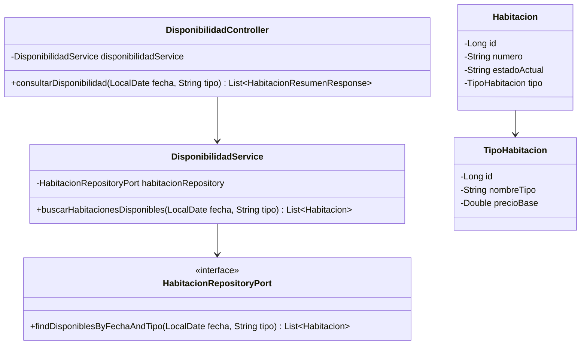

##### **Diagrama de Secuencia (CU-01)**
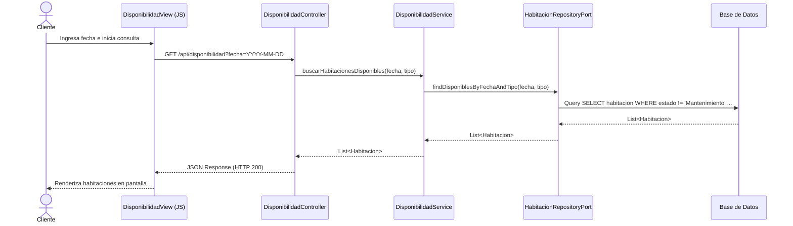

##### **Diagrama de Robustez (CU-01 - PlantUML)**
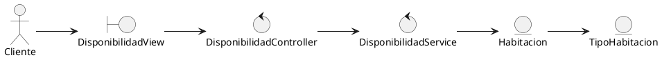

---

#### **CASO DE USO: Registrar Reserva (CU-02)**
* **Actor Principal:** Cliente
* **Propósito:** Crear una reserva y bloquear temporalmente una habitación.
* **Precondición:** El cliente seleccionó una habitación disponible.
* **Postcondición:** Reserva guardada en la BD en estado PENDIENTE_PAGO.

##### **Flujo de Trabajo**
1. El Cliente completa sus datos (Nombre, CI, celular) y carga imágenes de su CI.
2. El sistema valida que los campos estén completos (RN-04) y guarda las fotos.
3. El Cliente confirma el registro de la reserva.
4. El sistema crea el registro del Huésped y genera la Reserva en estado "PENDIENTE_PAGO" (RN-01).
*Camino Alternativo 4a:* Conflicto de concurrencia: si otra persona reservó al mismo tiempo, el sistema avisa del error y cancela.

##### **UML de Clases (CU-02)**
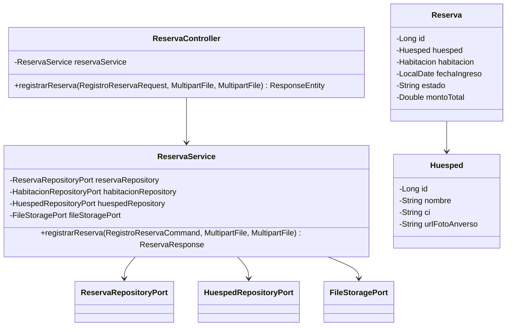

##### **Diagrama de Secuencia (CU-02)**
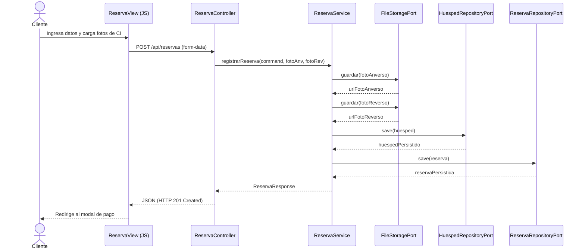

##### **Diagrama de Robustez (CU-02 - PlantUML)**
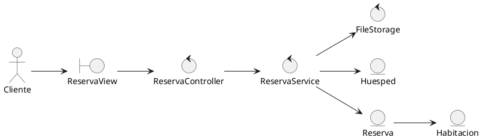

---

#### **CASO DE USO: Procesar Pago (CU-03)**
* **Actores:** Cliente / Recepcionista, API BNB (Externo)
* **Propósito:** Confirmar la transacción monetaria para formalizar la reserva.
* **Precondición:** Existe una reserva en estado "PENDIENTE_PAGO".
* **Postcondición:** La reserva cambia al estado "PAGADA" y se emite Comprobante.

##### **Flujo de Trabajo**
1. El Cliente solicita pagar la reserva y selecciona el método de pago.
2. Si elige QR: el sistema envía cobro al BNB (BNB API) y renderiza el QR en pantalla.
3. El Cliente paga desde su banca móvil.
4. El sistema realiza consultas periódicas (polling) al BNB, valida la transacción, cambia la reserva a "PAGADA", genera el comprobante digital e inicia la ventana límite de check-in de 30 minutos (RN-07).
*Camino Alternativo 2a:* Si elige Efectivo, el Recepcionista confirma el cobro físico en la consola de recepción, activando el mismo flujo de pago (Paso 4).

##### **UML de Clases (CU-03)**
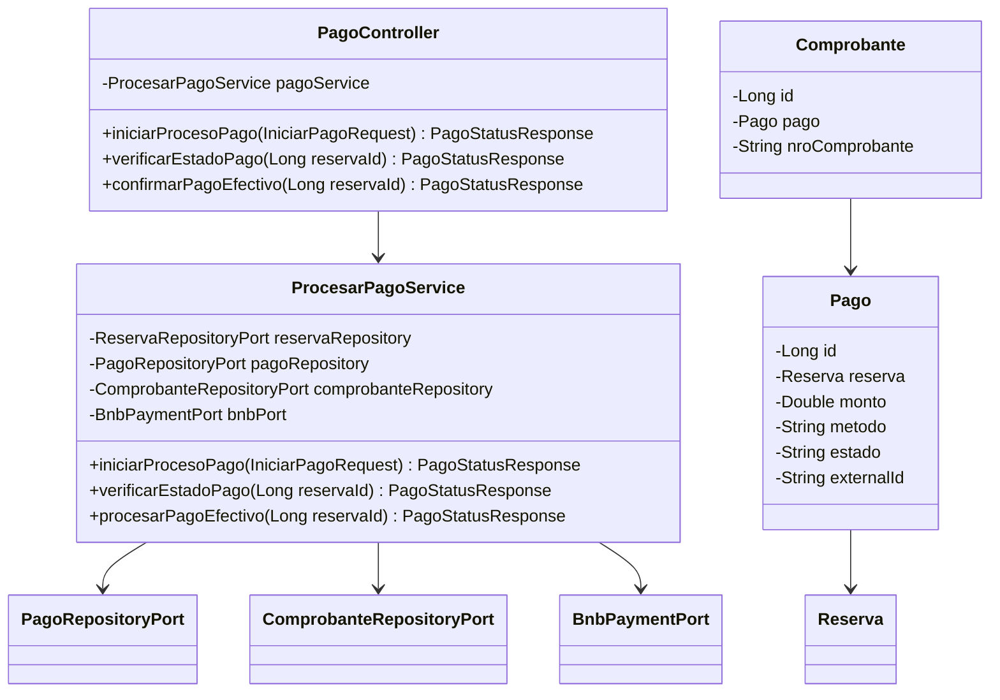

##### **Diagrama de Secuencia (CU-03 - Pago QR)**
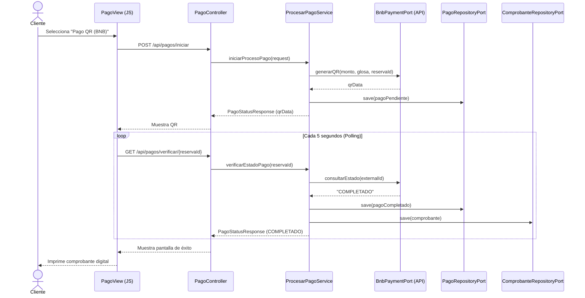

##### **Diagrama de Robustez (CU-03 - PlantUML)**
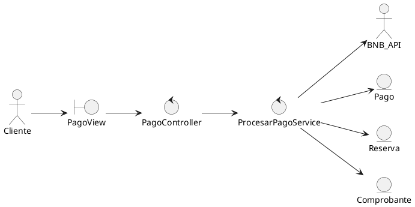

---

#### **CASO DE USO: Realizar Check-in (CU-04)**
* **Actores:** Recepcionista (Principal), Cliente
* **Propósito:** Confirmar la llegada física del cliente, validar su identidad y la del acompañante.
* **Precondición:** Reserva en estado "PAGADA" (o compromiso de Efectivo activo) y recepcionista autenticado.
* **Postcondición:** Habitación en estado "Ocupada", Reserva en estado "ACTIVA" (RN-04).

##### **Flujo de Trabajo**
1. El Recepcionista localiza la reserva por CI, Código o Nombre.
2. El Recepcionista coteja la identidad del huésped con el documento cargado.
3. El Recepcionista solicita y registra el nombre, CI y fotos del acompañante.
4. El Recepcionista confirma el check-in.
5. El sistema actualiza la Habitación a "Ocupada" y la Reserva a "ACTIVA" en el turno (RN-05).
*Camino Alternativo 3a:* Falsificación o error de identidad: se cancela la reserva y la habitación se libera.

##### **UML de Clases (CU-04)**
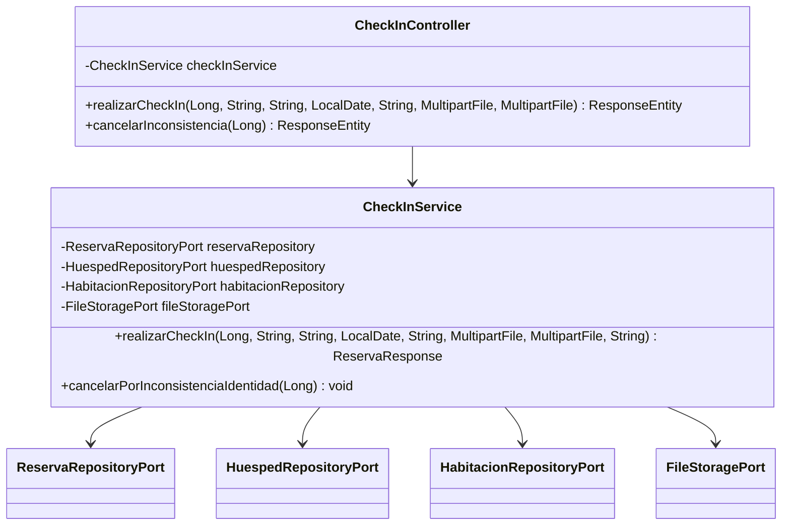

##### **Diagrama de Secuencia (CU-04)**
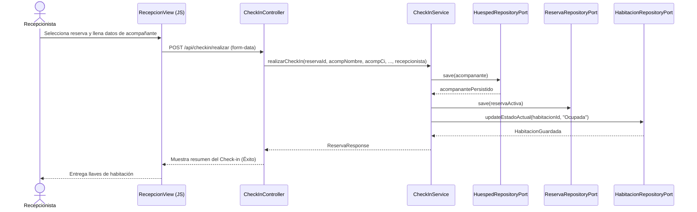

##### **Diagrama de Robustez (CU-04 - PlantUML)**
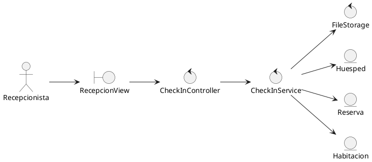

---

#### **CASO DE USO: Validar Acceso en Puerta (CU-05)**
* **Actor Principal:** Cliente
* **Propósito:** Validar el QR en la puerta física de la habitación de forma autónoma.
* **Precondición:** Reserva en estado "PAGADA" o "ACTIVA".
* **Postcondición:** Cerradura de puerta física se abre; check-in iniciado de forma automática si estaba pagada.

##### **Flujo de Trabajo**
1. El Cliente escanea el QR en la tablet de la puerta.
2. La tablet remite la solicitud de validación.
3. El sistema valida si la reserva existe, coincide con el número de habitación y está activa (RN-08).
4. El sistema envía señal de apertura física y muestra bienvenida en la pantalla.
*Camino Alternativo 3a:* QR Inválido o reserva no pagada/activa: se deniega la entrada y suena alarma.

##### **UML de Clases (CU-05)**
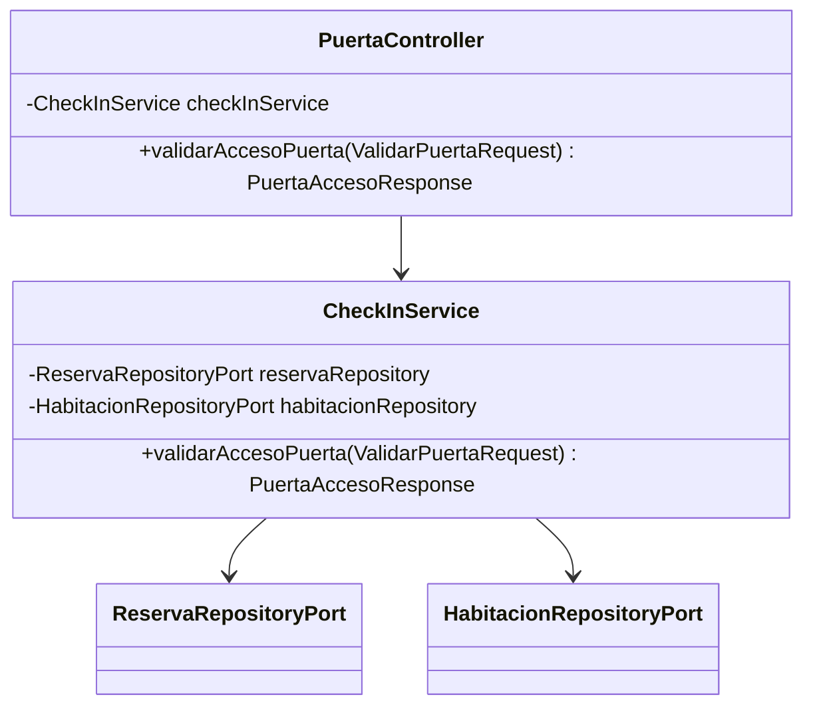

##### **Diagrama de Secuencia (CU-05)**
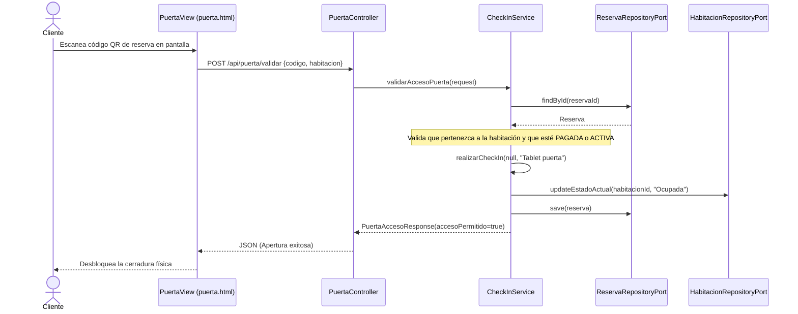

##### **Diagrama de Robustez (CU-05 - PlantUML)**
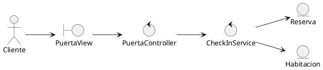

---

#### **CASO DE USO: Pago de Consumos Extra (CU-06)**
* **Actor Principal:** Cliente
* **Propósito:** Permitir compras de productos de la heladera/habitación por QR.
* **Precondición:** El cliente tiene una reserva en estado "ACTIVA".
* **Postcondición:** Stock actualizado en el inventario; consumo registrado como pagado.

##### **Flujo de Trabajo**
1. El Cliente escanea el producto en el portal.
2. El sistema valida el stock disponible.
3. El Cliente genera el QR de pago consolidado por los consumos.
4. El Cliente paga; el sistema valida el cobro, descuenta el inventario y actualiza saldos a cero.
*Camino Alternativo 2a:* Sin stock suficiente: el sistema avisa de la falta de producto y no permite el carrito.

##### **UML de Clases (CU-06)**
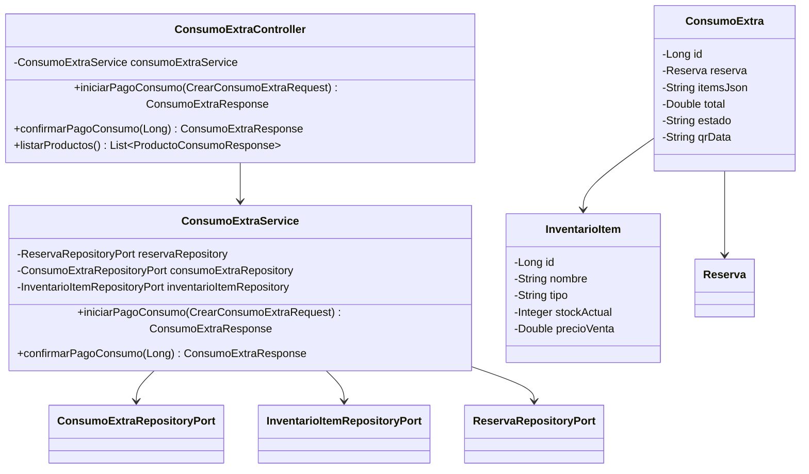

##### **Diagrama de Secuencia (CU-06)**
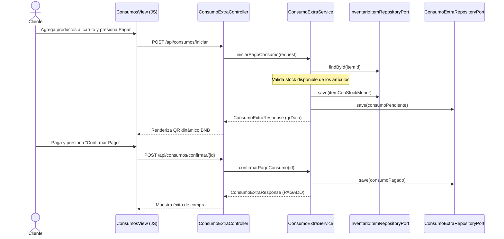

##### **Diagrama de Robustez (CU-06 - PlantUML)**
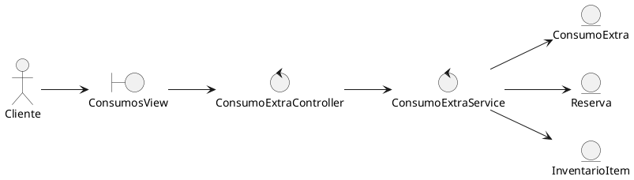

---

#### **CASO DE USO: Gestión de Inventario de Habitaciones (CU-07)**
* **Actor Principal:** Recepcionista / Camarera (Apoyo)
* **Propósito:** Ajustar y auditar la cantidad de ítems físicos presentes en una habitación.
* **Precondición:** La habitación se encuentra liberada para limpieza. Recepcionista autenticado.
* **Postcondición:** Stock conciliado. Si faltaban ítems, se genera un registro de pérdida financiera automática.

##### **Flujo de Trabajo**
1. La Camarera cuenta los ítems de la habitación e informa a recepción.
2. El Recepcionista ingresa las cantidades físicas contadas de cada ítem en el panel.
3. El sistema compara la cantidad real con la esperada.
4. Si hay faltante, marca el estado "FALTANTE" y registra la pérdida en *Egresos* al costo de compra (RN-09).
*Camino Alternativo 3a:* Si no hay diferencias, el ítem se marca como "OK" y no se genera gasto.

##### **UML de Clases (CU-07)**
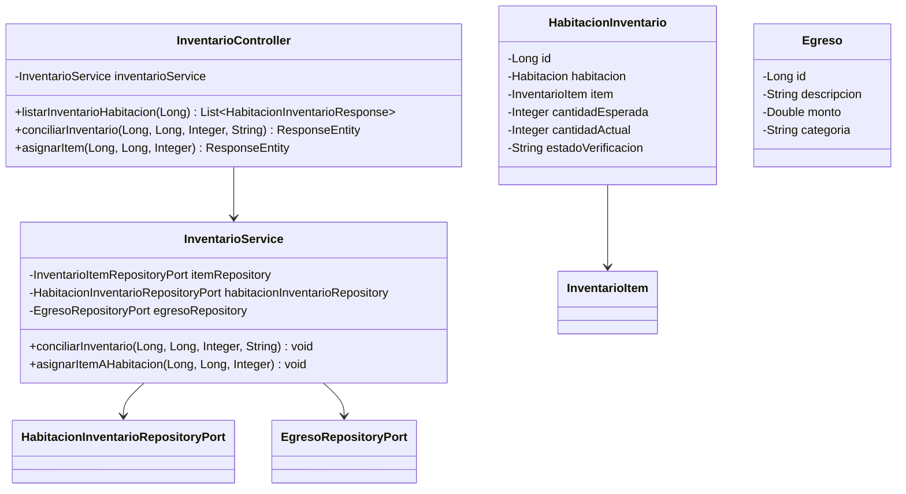

##### **Diagrama de Secuencia (CU-07)**
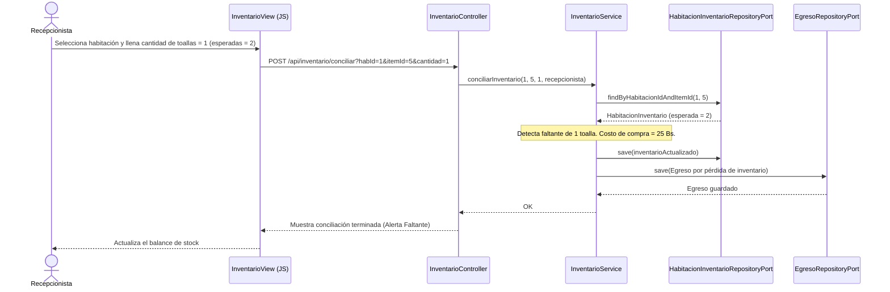

##### **Diagrama de Robustez (CU-07 - PlantUML)**
```plantuml
@startuml
left to right direction

actor Recepcionista
boundary InventarioView
control InventarioController
control InventarioService
entity HabitacionInventario
entity InventarioItem
entity Egreso

Recepcionista --> InventarioView
InventarioView --> InventarioController
InventarioController --> InventarioService
InventarioService --> HabitacionInventario
InventarioService --> InventarioItem
InventarioService --> Egreso
@enduml
```

---

#### **CASO DE USO: Gestión de Incidencias de Mantenimiento (CU-08)**
* **Actor Principal:** Recepcionista
* **Propósito:** Registrar e informar averías físicas en la habitación para bloquearla temporalmente.
* **Precondición:** El recepcionista está autenticado.
* **Postcondición:** Habitación en estado "Mantenimiento". Al repararse, se registra el costo en Egresos y se libera.

##### **Flujo de Trabajo**
1. El Recepcionista ingresa el número de habitación, el ítem averiado y la descripción del daño.
2. El sistema guarda la incidencia en estado "PENDIENTE" y pasa la habitación a "Mantenimiento" (RN-10).
3. Una vez reparada, el Recepcionista ingresa el costo de reparación y marca la incidencia como "REPARADA".
4. El sistema guarda la resolución, registra un *Egreso* por el monto gastado y pasa la habitación a "Disponible" si no hay más incidencias abiertas en la misma (RN-03).

##### **UML de Clases (CU-08)**
```mermaid
classDiagram
    class AdministracionController {
        -AdministracionService adminService
        +crearIncidencia(IncidenciaAdminRequest) IncidenciaResponse
        +actualizarIncidencia(Long, IncidenciaAdminRequest) IncidenciaResponse
    }
    class AdministracionService {
        -IncidenciaMantenimientoRepositoryPort incidenciaRepository
        -HabitacionRepositoryPort habitacionRepository
        -EgresoRepositoryPort egresoRepository
        +crearIncidencia(IncidenciaAdminRequest) IncidenciaResponse
        +actualizarIncidencia(Long, IncidenciaAdminRequest) IncidenciaResponse
    }
    class IncidenciaMantenimiento {
        -Long id
        -Habitacion habitacion
        -InventarioItem item
        -String descripcion
        -String estado
        -Double costoReparacion
    }
    AdministracionController --> AdministracionService
    AdministracionService --> IncidenciaMantenimientoRepositoryPort
    AdministracionService --> HabitacionRepositoryPort
    AdministracionService --> EgresoRepositoryPort
    IncidenciaMantenimiento --> Habitacion
```

##### **Diagrama de Secuencia (CU-08 - Registro y Cierre)**
```mermaid
sequenceDiagram
    actor Recepcionista
    participant Vista as MantenimientoView (JS)
    participant Ctrl as AdministracionController
    participant Serv as AdministracionService
    participant IRepo as IncidenciaMantenimientoRepositoryPort
    participant HRepo as HabitacionRepositoryPort
    participant ERepo as EgresoRepositoryPort

    Recepcionista->>Vista: Reporta "Grifo roto en Hab 102"
    Vista->>Ctrl: POST /api/admin/incidencias
    Ctrl->>Serv: crearIncidencia(request)
    Serv->>IRepo: save(incidenciaPendiente)
    Serv->>HRepo: updateEstadoActual(102, "Mantenimiento")
    Serv-->>Ctrl: IncidenciaResponse
    Ctrl-->>Vista: Habitación bloqueada en panel
    Note over Recepcionista, Vista: Transcurre la reparación
    Recepcionista->>Vista: Marca resuelta, Costo = 80 Bs
    Vista->>Ctrl: PUT /api/admin/incidencias/{id}
    Ctrl->>Serv: actualizarIncidencia(id, requestConResolucion)
    Serv->>IRepo: save(incidenciaReparada)
    Serv->>ERepo: save(Egreso por reparación)
    Serv->>IRepo: findByHabitacionIdAndEstado(102, "PENDIENTE")
    Note over Serv: Valida que no queden incidencias pendientes en la hab 102
    Serv->>HRepo: updateEstadoActual(102, "Disponible")
    Serv-->>Ctrl: IncidenciaResponse
    Ctrl-->>Vista: Habitación liberada a Disponible
```

##### **Diagrama de Robustez (CU-08 - PlantUML)**
```plantuml
@startuml
left to right direction

actor Recepcionista
boundary MantenimientoView
control AdministracionController
control AdministracionService
entity IncidenciaMantenimiento
entity Habitacion
entity Egreso

Recepcionista --> MantenimientoView
MantenimientoView --> AdministracionController
AdministracionController --> AdministracionService
AdministracionService --> IncidenciaMantenimiento
AdministracionService --> Habitacion
AdministracionService --> Egreso
@enduml
```

---

#### **CASO DE USO: Ventas Directas de Insumos (CU-09)**
* **Actor Principal:** Recepcionista
* **Propósito:** Registrar ventas de productos de caja a clientes de paso o recepción.
* **Precondición:** Recepcionista autenticado en el panel.
* **Postcondición:** Venta asentada; stock decrementado en tiempo real.

##### **Flujo de Trabajo**
1. El Recepcionista selecciona los productos del listado e indica la cantidad.
2. El sistema valida la existencia y stock en inventario.
3. El Recepcionista recibe el dinero en efectivo y confirma la venta.
4. El sistema decrementa el stock del artículo y guarda el registro de la venta en estado "PAGADO".

##### **UML de Clases (CU-09)**
```mermaid
classDiagram
    class VentaInsumoController {
        -VentaInsumoService ventaService
        +registrarVenta(CrearVentaInsumoRequest) VentaInsumoResponse
        +listarHistorial() List~HistorialVentaInsumoResponse~
    }
    class VentaInsumoService {
        -JpaVentaInsumoRepository ventaRepository
        -InventarioItemRepositoryPort inventarioItemRepository
        +registrarVenta(CrearVentaInsumoRequest) VentaInsumoResponse
        +listarHistorial() List~HistorialVentaInsumoResponse~
    }
    class VentaInsumo {
        -Long id
        -String cliente
        -String itemsJson
        -Double total
        -String estado
        -String recepcionista
    }
    VentaInsumoController --> VentaInsumoService
    VentaInsumoService --> JpaVentaInsumoRepository
    VentaInsumoService --> InventarioItemRepositoryPort
    VentaInsumo --> InventarioItem
```

##### **Diagrama de Secuencia (CU-09)**
```mermaid
sequenceDiagram
    actor Recepcionista
    participant Vista as VentasView (JS)
    participant Ctrl as VentaInsumoController
    participant Serv as VentaInsumoService
    participant IRepo as InventarioItemRepositoryPort
    participant VRepo as JpaVentaInsumoRepository

    Recepcionista->>Vista: Agrega 2 cervezas a la venta directa
    Vista->>Ctrl: POST /api/ventas/insumos
    Ctrl->>Serv: registrarVenta(request)
    Serv->>IRepo: findById(cervezaId)
    Note over Serv: Valida stock suficiente en inventario
    Serv->>IRepo: save(itemConStockMenor)
    Serv->>VRepo: save(ventaInsumoPagada)
    VRepo-->>Serv: VentaInsumo guardada
    Serv-->>Ctrl: VentaInsumoResponse
    Ctrl-->>Vista: Muestra recibo de la venta (Éxito)
```

##### **Diagrama de Robustez (CU-09 - PlantUML)**
```plantuml
@startuml
left to right direction

actor Recepcionista
boundary VentasView
control VentaInsumoController
control VentaInsumoService
entity VentaInsumo
entity InventarioItem

Recepcionista --> VentasView
VentasView --> VentaInsumoController
VentaInsumoController --> VentaInsumoService
VentaInsumoService --> VentaInsumo
VentaInsumoService --> InventarioItem
@enduml
```

---

#### **CASO DE USO: Administración de Personal y Clientes (CU-10)**
* **Actor Principal:** Administrador / Recepcionista
* **Propósito:** Administrar los catálogos y datos del personal operativo y clientes del hotel.
* **Precondición:** Administrador/Recepcionista debidamente autenticado.
* **Postcondición:** Datos actualizados en el sistema.

##### **Flujo de Trabajo**
1. El Administrador ingresa al módulo de administración y selecciona Recepcionistas, Camareras o Clientes.
2. Llena el formulario para crear o modificar.
3. El sistema valida las claves, duplicidad de nombres o usernames, y guarda la entidad en base de datos.
4. Para dar de baja, el sistema inactiva el campo "activo" para no romper la integridad referencial de reportes antiguos.

##### **UML de Clases (CU-10)**
```mermaid
classDiagram
    class AdministracionController {
        -AdministracionService adminService
        +listarClientes() List
        +crearCamarera(CamareraRequest) CamareraResponse
        +actualizarRecepcionista(Long, RecepcionistaAdminRequest) RecepcionistaAdminResponse
    }
    class AdministracionService {
        -HuespedRepositoryPort huespedRepository
        -CamareraRepositoryPort camareraRepository
        -RecepcionistaRepositoryPort recepcionistaRepository
        +crearCliente(ClienteRequest) ClienteResponse
        +crearCamarera(CamareraRequest) CamareraResponse
        +crearRecepcionista(RecepcionistaAdminRequest) RecepcionistaAdminResponse
    }
    class Recepcionista {
        -Long id
        -String nombre
        -String username
        -String password
        -Boolean activo
    }
    class Camarera {
        -Long id
        -String nombre
        -String celular
        -Boolean activo
    }
    AdministracionController --> AdministracionService
    AdministracionService --> HuespedRepositoryPort
    AdministracionService --> CamareraRepositoryPort
    AdministracionService --> RecepcionistaRepositoryPort
```

##### **Diagrama de Secuencia (CU-10 - Crear Recepcionista)**
```mermaid
sequenceDiagram
    actor Administrador
    participant Vista as AdminView (JS)
    participant Ctrl as AdministracionController
    participant Serv as AdministracionService
    participant RRepo as RecepcionistaRepositoryPort

    Administrador->>Vista: Ingresa nuevo recepcionista y clave
    Vista->>Ctrl: POST /api/admin/recepcionistas
    Ctrl->>Serv: crearRecepcionista(request)
    Serv->>RRepo: findByUsername(username)
    Note over Serv: Valida que el nombre de usuario no esté duplicado
    Serv->>RRepo: save(recepcionista)
    RRepo-->>Serv: Recepcionista guardada
    Serv-->>Ctrl: RecepcionistaAdminResponse
    Ctrl-->>Vista: Recepcionista agregado a la grilla
```

##### **Diagrama de Robustez (CU-10 - PlantUML)**
```plantuml
@startuml
left to right direction

actor Administrador
boundary AdminView
control AdministracionController
control AdministracionService
entity Recepcionista
entity Camarera
entity Huesped

Administrador --> AdminView
AdminView --> AdministracionController
AdministracionController --> AdministracionService
AdministracionService --> Recepcionista
AdministracionService --> Camarera
AdministracionService --> Huesped
@enduml
```

---

#### **CASO DE USO: Caja y Egresos / Reportes Financieros (CU-11)**
* **Actor Principal:** Administrador / Recepcionista
* **Propósito:** Registrar los egresos operativos en caja y consultar el reporte de flujos en tiempo real.
* **Precondición:** Autenticado en el módulo financiero.
* **Postcondición:** Egreso creado con link al comprobante digital; reporte financiero de flujos emitido.

##### **Flujo de Trabajo**
1. El Recepcionista ingresa un egreso en la caja (Monto, Categoria, Descripción, Destinatario) y sube una foto del recibo.
2. El sistema guarda la imagen del comprobante y registra el Egreso.
3. El Administrador solicita el Reporte Financiero definiendo el rango de fechas.
4. El sistema consulta todos los Pagos (ingresos por reservas), ConsumosExtra y Ventas de Insumos cobrados, suma los Egresos registrados y calcula el Saldo Neto.

##### **UML de Clases (CU-11)**
```mermaid
classDiagram
    class FinanzasController {
        -FinanzasService finanzasService
        +registrarEgreso(EgresoRequest, MultipartFile) EgresoResponse
        +obtenerReporte(LocalDate, LocalDate) ReporteFinanzasResponse
    }
    class FinanzasService {
        -EgresoRepositoryPort egresoRepository
        -JpaPagoRepository jpaPagoRepository
        -JpaConsumoExtraRepository jpaConsumoExtraRepository
        -JpaVentaInsumoRepository jpaVentaInsumoRepository
        -FileStoragePort fileStoragePort
        +registrarEgreso(EgresoRequest, MultipartFile) EgresoResponse
        +obtenerReporteFinanzas(LocalDate, LocalDate) ReporteFinanzasResponse
    }
    class Egreso {
        -Long id
        -String descripcion
        -Double monto
        -String categoria
        -LocalDateTime fecha
        -String urlComprobante
    }
    FinanzasController --> FinanzasService
    FinanzasService --> EgresoRepositoryPort
    FinanzasService --> JpaPagoRepository
    FinanzasService --> JpaConsumoExtraRepository
    FinanzasService --> JpaVentaInsumoRepository
    FinanzasService --> FileStoragePort
```

##### **Diagrama de Secuencia (CU-11)**
```mermaid
sequenceDiagram
    actor Administrador
    participant Vista as FinanzasView (JS)
    participant Ctrl as FinanzasController
    participant Serv as FinanzasService
    participant ERepo as EgresoRepositoryPort
    participant PRepo as JpaPagoRepository
    participant CRepo as JpaConsumoExtraRepository
    participant VRepo as JpaVentaInsumoRepository

    Administrador->>Vista: Solicita reporte financiero (Fecha Inicio / Fin)
    Vista->>Ctrl: GET /api/finanzas/reporte?inicio=...&fin=...
    Ctrl->>Serv: obtenerReporteFinanzas(inicio, fin)
    Serv->>PRepo: findAll()
    PRepo-->>Serv: List<Pago> (completados en el rango)
    Serv->>CRepo: findAll()
    CRepo-->>Serv: List<ConsumoExtra> (pagados en el rango)
    Serv->>VRepo: findAll()
    VRepo-->>Serv: List<VentaInsumo> (pagados en el rango)
    Serv->>ERepo: findAll()
    ERepo-->>Serv: List<Egreso> (en el rango)
    Note over Serv: Calcula Totales de Ingresos, Egresos y Saldo Neto
    Serv-->>Ctrl: ReporteFinanzasResponse
    Ctrl-->>Vista: Retorna JSON consolidado
    Vista-->>Administrador: Renderiza gráficos de barras y tablas
```

##### **Diagrama de Robustez (CU-11 - PlantUML)**
```plantuml
@startuml
left to right direction

actor Administrador
boundary FinanzasView
control FinanzasController
control FinanzasService
entity Egreso
entity Pago
entity ConsumoExtra
entity VentaInsumo

Administrador --> FinanzasView
FinanzasView --> FinanzasController
FinanzasController --> FinanzasService
FinanzasService --> Egreso
FinanzasService --> Pago
FinanzasService --> ConsumoExtra
FinanzasService --> VentaInsumo
@enduml
```

---

## **13. VERIFICACIÓN Y VALIDACIÓN (REFACTOR V4)**

### **13.1 Pruebas Unitarias Automatizadas**
El sistema integrado posee suites de pruebas basadas en JUnit 5 y Mockito para la verificación de las reglas de negocio principales.
* **Comando para ejecutar la suite de pruebas del Backend:**
```bash
cd 04_Implementacion/sistema-integrado/backend
mvn test
```
* **Pruebas clave validadas en la suite:**
  - `ProcesarPagoServiceTest`: valida la lógica de expiración de códigos QR (5 minutos), anulación automática de la reserva (RN-07) y simulación transaccional.
  - `InventarioServiceTest`: valida que al conciliar toallas/controles remotos de una habitación con faltantes se genere de forma consistente el Egreso de caja a costo de compra (RN-09).
  - `CheckInServiceTest`: valida que el registro del check-out de un huésped genere penalizaciones por ítems en mal estado (ConsumoExtra) y que las incidencias bloqueen la habitación en Mantenimiento (RN-10, RN-11).

---

### **13.2 Verificación Manual**
El proyecto se verifica mediante la consola web integrada interactiva en Nginx.
1. **Lanzar servicios locales:**
```bash
docker compose up -d --build
```
2. **Prueba en cliente (Disponibilidad y Compra):** acceder a `http://localhost`, realizar reserva y pagar con el simulador de QR BNB en pantalla.
3. **Validación en cerradura autónoma:** abrir `http://localhost/puerta.html?habitacion=101` (para simular el lector QR de la puerta 101), ingresar el código de reserva y validar el desbloqueo físico.
4. **Verificación en el panel de recepción:** acceder a `http://localhost/recepcion.html`, autenticarse con el recepcionista semilla (`recepcion1` / `123456`), y probar los módulos consolidados:
   - Panel de habitaciones interactivo en tiempo real (Limpieza, Mantenimiento, Ocupada, Disponible).
   - Auditoría de stock de habitaciones y conciliación física.
   - Creación de egresos manuales con adjunto de imagen.
   - Generación de reportes de flujo de caja y distribución de egresos por categorías.

---

[image1]: (Imagen del banner del proyecto omitida en V4)
[image2]: (Diagrama manual de consulta de disponibilidad omitido en V4)
[image3]: (Mockup de pantalla de disponibilidad omitido en V4)
[image4]: (Diagrama manual de registro de reserva omitido en V4)
[image5]: (Mockup de pantalla de registro de reserva omitido en V4)
[image6]: (Diagrama manual de procesamiento de pagos BNB omitido en V4)
[image7]: (Mockup de pantalla de pago por QR BNB omitido en V4)
[image8]: (Diagrama manual de flujo de Check-in en recepción omitido en V4)
[image9]: (Mockup del panel administrativo de Check-in omitido en V4)
[image10]: (Diagrama manual de validación de cerradura de puerta omitido en V4)
[image11]: (Mockup de la interfaz física de la puerta de habitación omitido en V4)
[image12]: (Diagrama manual de selección y pago de consumo extra omitido en V4)
[image13]: (Mockup del menú de consumos de la heladera de habitación omitido en V4)
[image14]: (Diagrama del Modelo de Dominio original del proyecto omitido en V4)
